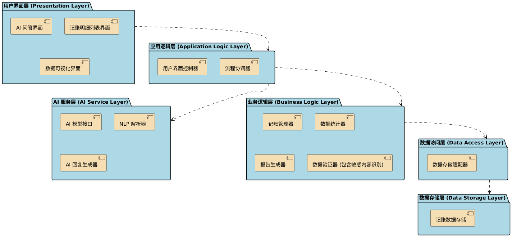

# AIccounting 架构设计文档

## 1. 引言

### 1.1 文档目的
本文档旨在描述"爱记账"软件的整体架构设计，包括系统的主要组成部分、它们之间的关系、关键设计决策以及重要的非功能性属性。本文档将作为开发团队进行详细设计和实现的基础。

### 1.2 系统概述
"爱记账"是一款个人记账应用，旨在通过创新的 AI 问答功能，简化用户的记账流程。用户可以通过自然语言与应用交互进行记账、查询和生成消费报告。同时，应用也提供传统的列表方式查看和管理记账明细，并支持多种维度的数据可视化分析。

### 1.3 术语表

| 术语 | 定义 |
| ---- | ---- |
| 记账条目 | 一条收入或支出的记录 |
| AI 问答 | 用户通过自然语言与应用进行交互的方式 |
| NLP | 自然语言处理 |
| 数据可视化 | 将数据以图表形式展示 |
| 大类标签 | 对记账条目的分类（如：餐饮、交通、工资等）|
| 敏感内容识别 | 识别并提示违法乱纪的记账内容 |

## 2. 架构视图
我们将采用逻辑视图、开发视图和运行时视图来描述"爱记账"的架构。

### 2.1 逻辑视图
逻辑视图描述系统的抽象结构，关注系统的主要功能块以及它们之间的依赖关系。

**图示： 逻辑视图分层图**

 
- **用户界面层 (Presentation Layer)**:
  - AI 问答界面
  - 记账明细列表界面
  - 数据可视化界面
- **应用逻辑层 (Application Logic Layer)**:
  - 用户界面控制器
  - 流程协调器
- **业务逻辑层 (Business Logic Layer)**:
  - 记账管理器
  - 数据统计器
  - 报告生成器
  - 数据验证器 (包含敏感内容识别)
- **AI 服务层 (AI Service Layer)**:
  - AI 模型接口
  - NLP 解析器
  - AI 回复生成器
- **数据访问层 (Data Access Layer)**:
  - 数据存储适配器
- **数据存储层 (Data Storage Layer)**:
  - 记账数据存储

**层间依赖关系描述**:
- 用户界面层依赖于应用逻辑层。
- 应用逻辑层依赖于业务逻辑层和 AI 服务层。
- 业务逻辑层依赖于数据访问层。
- AI 服务层依赖于外部 AI API。
- 数据访问层依赖于数据存储层。

### 2.2 运行时视图

**运行时视图**

本系统的运行时视图采用用例图方式，展示了"AI智能记账助手系统"在实际运行中各参与者与系统功能模块的交互关系。如下图所示：

**图示：AI智能记账助手系统用例图**

- **主要参与者**:
  - **用户**：普通使用者，可以通过AI对话进行记账、生成消费报告、日常聊天，也可以查看和管理自己的账目明细。
  - **管理员**：系统维护者，负责系统设置和高级数据管理（如自定义大类标签）。
- **主要功能模块与用例**:
  - **a. AI交互模块**
    - 通过对话进行日常记账（UC_AI_002）
    - 通过对话生成消费报告（UC_AI_003）
    - 进行日常聊天（UC_AI_001）
  - **b. 数据管理模块**
    - 修改已记录的账目（UC_DS_001）
    - 管理自定义大类标签（UC_DS_002）
  - **c. 数据可视化模块**
    - 查看收支明细列表（UC_DV_001）
    - 筛选收支数据（UC_DV_002，扩展于明细列表）
    - 查看财务数据可视化图表（UC_DV_003，扩展于明细列表）
    - 查看按小时/分钟的每日财务数据（UC_DV_004，扩展于图表）
  - **d. 系统管理模块**
    - 进行系统设置（UC_SYS_001，仅管理员可用）
- **用例关系说明**:
  - "筛选收支数据"是"查看收支明细列表"的扩展功能。
  - "查看财务数据可视化图表"是"查看收支明细列表"的扩展功能。
  - "查看按小时/分钟的每日财务数据"是"查看财务数据可视化图表"的扩展功能。
  - "查看收支明细列表"被"数据管理模块"中的"修改已记录的账目"用例包含。
- **交互流程简述**:
  - 用户通过AI交互模块进行自然语言记账、报表查询或日常聊天，系统自动解析并处理相关数据。
  - 用户可在数据管理模块中修改账目、管理标签。
  - 用户可在数据可视化模块中查看、筛选和分析自己的财务数据。
  - 管理员可进行系统设置和高级数据管理。

## 3. 组件设计
本节详细描述系统中的主要组件及其职责。

### 3.1 用户界面组件
- **AI 问答界面组件**： 负责 AI 聊天和记账问答的 UI 展示和用户输入处理，以及调用消费报告的生成。
- **记账明细列表界面组件**： 负责记账条目的列表展示、筛选和排序，以及对于每一个条目触发修改和删除操作。
- **记账条目编辑/删除组件**： 提供修改和彻底删除记账条目的界面和逻辑。
- **数据可视化界面组件**： 负责根据用户数据的筛选条件，进行不同类型图表的展示。

### 3.2 应用逻辑组件
- **用户界面控制器**： 负责处理用户界面层的事件，协调业务逻辑和 AI 服务。
- **流程协调器**： 管理跨多个组件的复杂操作流程，例如通过 AI 问答完成记账的整个流程。

### 3.3 业务逻辑组件
- **记账管理器**： 管理记账条目的生命周期（创建、读取、更新、删除），处理记账相关的业务规则。
- **数据统计器**： 根据用户的筛选条件，进行记账数据的汇总和统计计算（总收入、总支出、净收入、按类别统计等）。
- **报告生成器**： 根据统计结果生成消费报告（周、月、年）。
- **数据验证器**： 对用户输入的记账数据进行验证，包括金额格式、日期有效性以及敏感内容的识别。

### 3.4 AI 服务组件
- **AI 模型接口**： 封装与实际 AI 模型（本地或云端）的交互逻辑。
- **NLP 解析器**： 使用自然语言处理技术，从用户文本中提取记账相关的关键信息（金额、类型、日期、描述）。
- **AI 回复生成器**： 根据处理结果和用户请求，生成自然语言的回复文本。

### 3.5 数据访问组件
- **数据存储适配器**： 提供统一的数据访问接口，将业务逻辑与具体的数据存储实现解耦。根据底层数据存储方式，实现不同的适配器。

### 3.6 数据存储组件
- **记账数据存储**： 负责记账数据的持久化。使用本地文件的方式（如 JSON 或 CSV）。

## 4. 关键设计决策

### AI 集成方式
- **决策**： 调用第三方 AI API
- **理由**：
  - **实现难度低**： 调用成熟的第三方 AI API 可以极大地降低开发难度和时间成本，无需从头构建和训练 AI 模型。
  - **性能和效果**： 第三方大型 AI API 通常经过大量数据训练和优化，在自然语言理解和处理方面具有更好的性能和效果，能够更准确地识别记账信息和提供高质量的聊天回复。
  - **无需维护模型**： 第三方服务提供商负责模型的维护、更新和基础设施管理，开发者无需投入精力。
  - **快速迭代**： 可以快速集成最新的 AI 能力，无需等待本地模型训练和部署。
  - **成本可控**： 对于个人或小型应用，按量付费的 API 调用成本可能比自建和维护 AI 基础设施更具成本效益。

### 数据存储方案
- **决策**： 本地数据库（例如，使用 SQLite 存储到本地文件）
- **理由**：
  - **高效的数据查询和统计**： 相比于简单的文件存储（如 JSON），数据库天生为数据查询、过滤、排序和聚合而设计。这对于"爱记账"应用中需要按日期、类型、收支维度进行筛选、统计和生成报告的功能至关重要，可以显著提高查询效率和响应速度。
  - **更好的数据管理（增删改）**： 数据库提供了优化的数据管理机制。修改或删除特定记账条目时，无需像文件存储那样加载整个文件、修改后再写回，而是可以直接对单条或多条记录进行操作，提高了效率，尤其在数据量增多时。
  - **支持索引提升性能**： 数据库可以为常用的查询字段（如时间、大类标签）创建索引。通过索引，系统可以非常快速地定位到需要的数据，极大地加速数据检索过程，提升用户体验。
  - **数据结构化和完整性**： 数据库强制执行预定义的数据模式（Schema），有助于保证数据的结构化和一致性，减少数据录入或修改可能导致的数据错误。
  - **应对数据量增长**： 随着用户记账条目的增加，本地数据库能够更有效地管理和处理更多的数据，性能衰减比简单的文件存储慢得多。

### 敏感内容识别策略
- **决策**： 采用 AI 大模型调用来识别敏感内容。
- **理由**：
  - **更高的准确率**： 相比于简单的关键词匹配或正则表达式，大型 AI 模型在理解文本语境和识别隐含的敏感信息方面具有更强的能力，可以有效降低误报和漏报率。
  - **更全面的识别范围**： AI 大模型能够识别更广泛的敏感内容类型，而不仅仅局限于预设的关键词列表。
  - **无需手动维护规则**： 无需手动维护和更新复杂的敏感词库和规则，降低维护成本。
  - **与 AI 问答功能集成**： 可以复用 AI 问答所使用的 AI 模型，降低额外的技术栈引入。
  - **应对变种和新出现的敏感词**： AI 模型具有一定的泛化能力，能够识别敏感词的变种或新出现的敏感表达。

## 5. 数据模型：记账条目 (LedgerEntry)

### 记账条目数据结构（后端以dict传递，数据库表entries）
- **id**: int（唯一标识，数据库自增主键）
- **amount**: float（金额，收入为正，支出为负）
- **category**: string（大类标签，如"餐饮"、"工资"等）
- **specific_name**: string（具体项目名称）
- **datetime**: string（记账时间，格式"YYYY-MM-DD HH:MM:SS"）
- **type**: string（"income" 或 "expense"）

### 接口定义

#### 主要后端接口与方法

- **AIAccountant**（chat.py，AI问答与敏感内容识别）
  - `process_user_message(user_message: str) -> dict/str`
    - 输入：用户自然语言消息
    - 输出：AI回复文本，及结构化记账条目（如有）

- **MySQLDataStore**（sql.py，数据存储）
  - `add_entry(entry: dict) -> int`
  - `update_entry(entry_id: int, updated_entry: dict) -> bool`
  - `delete_entry(entry_id: int) -> bool`
  - `get_entries(start_date=None, end_date=None, categories=None, include_income=True, include_expense=True) -> list`

#### 主要API接口（api.py）
- **POST /api/chat**
  - 入参：`{ message: string }`
  - 返回：`{ replyText: string, ledgerEntries?: list, ledgerEntry?: dict }`
- **GET /get_transaction_list_for_frontend**
  - 入参：`start_date, end_date, transaction_type`
  - 返回：`{ transactions: list, summary: { total_income, total_expense, net_income } }`
- 其他如 `/get_chart_data_from_filters`、`/api/start` 等

## 6. 质量属性考虑
- **可用性**： 保证软件在用户设备上的稳定运行，提供友好的用户体验。
- **性能**： 确保记账、查询和可视化操作的快速响应，尤其是在数据量增长时。
- **可维护性**： 通过分层和模块化设计，降低代码的复杂性，提高修改和扩展的效率。
- **安全性**： 保护用户记账数据的隐私和安全。对敏感内容进行识别和提示，避免记录违法乱纪信息。
- **可扩展性**： 架构应支持未来可能增加的记账类型、报告维度或 AI 功能。
- **准确性**： 确保记账数据的记录、计算和统计结果的准确性。

