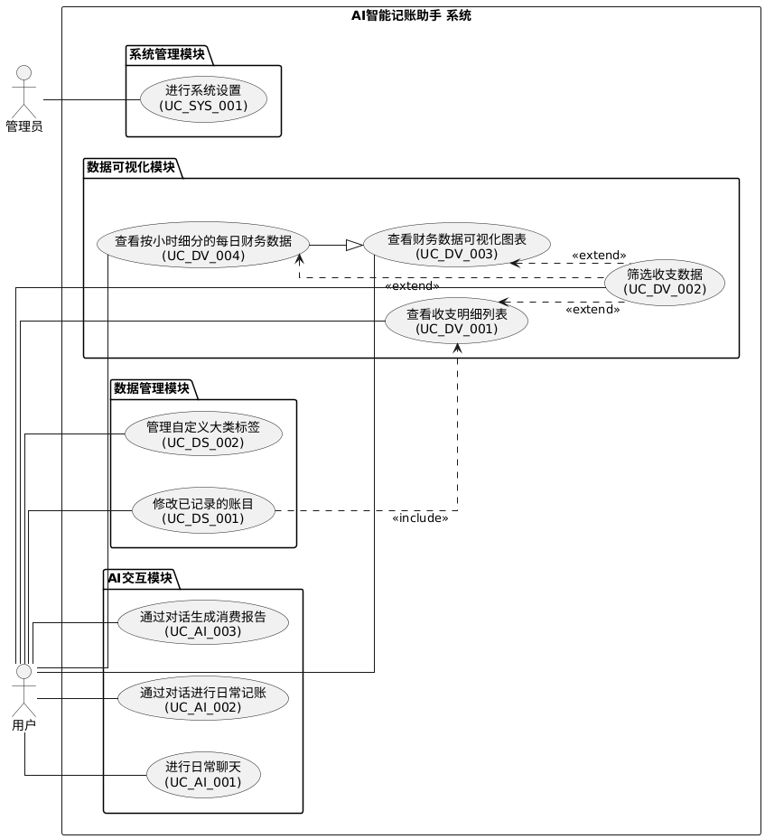
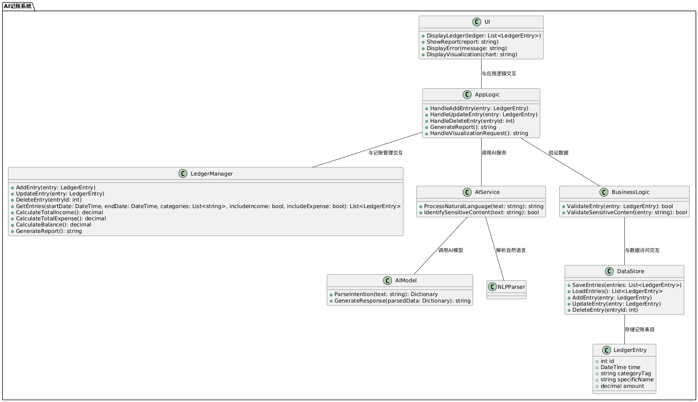
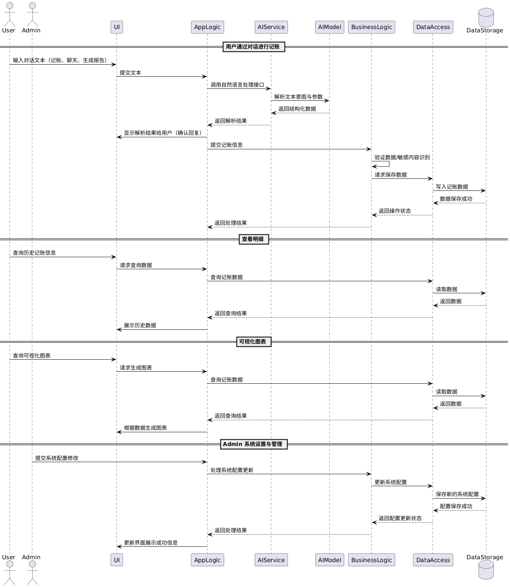
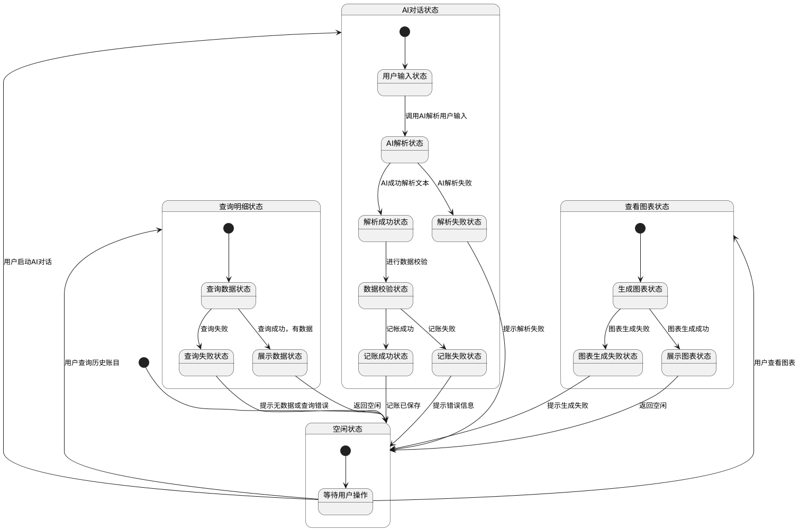

# AIccount 智能记账系统建模报告

## 系统概述

AIccount 智能记账系统是一款基于前后端分离架构的个人财务管理工具，前端采用 Vue.js，后端基于 Python 实现。系统通过集成 AI 助手，支持用户以自然语言方式快速录入账单，并实现账单的自动解析、分类和校验。用户不仅可以便捷地添加、查询和管理账单，还能查看历史数据和可视化图表，提升财务管理效率。

系统核心模块包括用户界面（UI）、应用逻辑（AppLogic）、AI 服务与模型（AIService）、业务逻辑（BusinessLogic）、数据访问（DataAccess/DataStore）和数据存储（DataStorage）。各模块分工明确，通过标准化接口协作，保证数据流转的安全性、一致性和可追溯性。

主要业务流程涵盖自然语言记账、历史账单查询、数据可视化、系统配置管理等场景。系统采用分层设计，支持账单的增删改查、敏感内容识别、数据校验和持久化存储，具备良好的可扩展性和维护性。前端页面结构清晰，后端接口完善，配套有详细的文档和测试用例，便于后续功能拓展和系统升级。

## 一、用例图

#### 1. 用户通过对话进行记账

- **参与者**：User
- **流程步骤**：
  1. 用户在UI输入记账文本（如“早餐10元”），提交文本。
  2. UI将文本传递给AppLogic，调用自然语言处理接口。
  3. AppLogic调用AIService，进行文本意图解析。
  4. AIService将文本及参数传递给AIModel，AIModel解析文本，返回结构化数据（如金额、类别、时间等）。
  5. AIService将解析结果返回AppLogic。
  6. AppLogic将解析结果反馈给UI，UI展示解析结果并等待用户确认。
  7. 用户确认无误后，UI将确认操作传递给AppLogic。
  8. AppLogic调用BusinessLogic进行数据校验和敏感内容识别。
  9. 校验通过后，AppLogic调用DataAccess请求保存数据。
  10. DataAccess将数据写入DataStorage。
  11. DataStorage返回保存成功状态。
  12. DataAccess将保存结果返回AppLogic，AppLogic反馈给UI，UI展示保存成功信息。

#### 2. 用户查询历史账单与数据

- **参与者**：User
- **流程步骤**：
  1. 用户在UI发起历史账单查询请求。
  2. UI将请求传递给AppLogic。
  3. AppLogic调用DataAccess查询账单数据。
  4. DataAccess从DataStorage读取账单数据。
  5. DataStorage返回账单数据给DataAccess。
  6. DataAccess将数据返回AppLogic，AppLogic反馈给UI。
  7. UI展示历史数据和图表。

#### 3. 各模块职责与交互细节

- **UI**：负责所有用户输入、结果展示、错误提示，是用户与系统的唯一交互界面。
- **AppLogic**：业务中枢，负责协调AI解析、数据校验、数据存取、业务流程控制。
- **AIService**：负责自然语言解析，调用AIModel进行意图识别和数据抽取。
- **AIModel**：实现具体的意图识别、数据抽取算法，返回结构化数据。
- **BusinessLogic**：负责所有账单数据的业务校验（如金额、分类、敏感内容等）。
- **DataAccess**：负责与数据存储层的所有读写操作，保证数据一致性和持久化。
- **DataStorage**：实际的数据存储介质（如数据库、文件系统等）。

#### 4. 交互顺序与数据流

- 每个业务流程均以用户操作为起点，经过UI、AppLogic、AIService、AIModel、BusinessLogic、DataAccess、DataStorage等模块的协作，最终将结果反馈给用户。
- 所有数据流转和状态变化均有明确的输入、处理、输出和反馈环节，保证系统的可追溯性和健壮性。

## 二、类图

#### 1. 主要类及其职责

#### 1.1 UI
- 负责与用户交互，展示账本、报表、错误信息和可视化图表。
- 主要方法：
  - DisplayLedger(ledger: List<LedgerEntry>)
  - ShowReport(report: string)
  - DisplayError(message: string)
  - DisplayVisualization(chart: string)

#### 1.2 AppLogic
- 应用逻辑层，处理账单的增删改查、报表生成、可视化请求等，调用AI服务并校验数据。
- 主要方法：
  - HandleAddEntry(entry: LedgerEntry)
  - HandleUpdateEntry(entry: LedgerEntry)
  - HandleDeleteEntry(entryId: int)
  - GenerateReport(): string
  - HandleVisualizationRequest(): string

#### 1.3 LedgerManager
- 账本管理核心，负责账单的增删改查、统计收入支出、计算结余、生成报表等。
- 主要方法：
  - AddEntry(entry: LedgerEntry)
  - UpdateEntry(entry: LedgerEntry)
  - DeleteEntry(entryId: int)
  - GetEntries(startDate: DateTime, endDate: DateTime, categories: List<string>, includeIncome: bool, includeExpense: bool): List<LedgerEntry>
  - CalculateTotalIncome(): decimal
  - CalculateTotalExpense(): decimal
  - CalculateBalance(): decimal
  - GenerateReport(): string

#### 1.4 AIService
- AI服务层，处理自然语言解析、敏感内容识别，调用AI模型。
- 主要方法：
  - ProcessNaturalLanguage(text: string): string
  - IdentifySensitiveContent(text: string): bool

#### 1.5 AIModel
- AI模型层，负责意图解析和响应生成。
- 主要方法：
  - ParseIntention(text: string): Dictionary
  - GenerateResponse(parsedData: Dictionary): string

#### 1.6 NLPParser
- 自然语言解析器，辅助AI模型进行文本解析。

#### 1.7 BusinessLogic
- 业务逻辑层，负责账单数据的校验和敏感内容校验。
- 主要方法：
  - ValidateEntry(entry: LedgerEntry): bool
  - ValidateSensitiveContent(entry: string): bool

#### 1.8 DataStore
- 数据存储层，负责账单的持久化、加载、更新和删除。
- 主要方法：
  - SaveEntries(entries: List<LedgerEntry>)
  - LoadEntries(): List<LedgerEntry>
  - AddEntry(entry: LedgerEntry)
  - UpdateEntry(entry: LedgerEntry)
  - DeleteEntry(entryId: int)

#### 1.9 LedgerEntry
- 账单条目实体，包含账单的基本数据结构。
- 主要属性：
  - int id
  - DateTime time
  - string categoryTag
  - string specificName
  - decimal amount

#### 2. 类之间的关系

- **UI** 与 **AppLogic** 交互，负责所有用户操作的入口和结果展示。
- **AppLogic** 作为业务中枢，协调 **LedgerManager**、**AIService**、**BusinessLogic**。
- **LedgerManager** 负责账本的所有核心操作，调用 **DataStore** 进行数据持久化。
- **AIService** 负责自然语言解析，调用 **AIModel** 和 **NLPParser**。
- **BusinessLogic** 负责所有账单数据的业务校验。
- **DataStore** 负责账单数据的存储和管理。
- **LedgerEntry** 作为账单的基本数据结构，被各模块广泛使用。

#### 3. 交互流程简述

- 用户通过UI输入账单信息（可为自然语言），UI将请求传递给AppLogic。
- AppLogic根据请求类型，调用AIService进行自然语言解析，或直接处理账单数据。
- AIService调用AIModel和NLPParser进行意图识别和数据抽取。
- AppLogic对解析结果进行业务校验（BusinessLogic），校验通过后调用LedgerManager进行账本操作。
- LedgerManager通过DataStore实现账单的持久化、查询、统计等功能。
- 结果通过AppLogic反馈给UI，UI展示给用户。

## 三、序列图

#### 1. 主要业务流程序列图

##### 1.1 用户通过对话进行记账

- **参与者**：User
- **流程步骤**：
  1. 用户在UI输入对话文本（如“早餐10元”）。
  2. UI将文本传递给AppLogic，调用自然语言处理接口。
  3. AppLogic调用AIService，进行文本意图解析。
  4. AIService将文本传递给AIModel，AIModel解析文本并返回结构化数据。
  5. AIService将解析结果返回AppLogic。
  6. AppLogic将解析结果反馈给UI，UI展示解析结果并等待用户确认。
  7. 用户确认无误后，UI将确认操作传递给AppLogic。
  8. AppLogic调用BusinessLogic进行数据校验（如金额、分类等）。
  9. 校验通过后，AppLogic调用DataAccess请求保存数据。
  10. DataAccess将数据写入DataStorage。
  11. DataStorage返回保存成功状态。
  12. DataAccess将保存结果返回AppLogic，AppLogic反馈给UI，UI展示保存成功信息。

##### 1.2 用户查询历史账单信息

- **参与者**：User
- **流程步骤**：
  1. 用户在UI发起历史账单查询请求。
  2. UI将请求传递给AppLogic。
  3. AppLogic调用DataAccess查询账单数据。
  4. DataAccess从DataStorage读取账单数据。
  5. DataStorage返回账单数据给DataAccess。
  6. DataAccess将数据返回AppLogic，AppLogic反馈给UI。
  7. UI展示历史账单信息。

##### 1.3 用户查询可视化图表

- **参与者**：User
- **流程步骤**：
  1. 用户在UI发起图表生成请求。
  2. UI将请求传递给AppLogic。
  3. AppLogic调用DataAccess查询账单数据。
  4. DataAccess从DataStorage读取账单数据。
  5. DataStorage返回账单数据给DataAccess。
  6. DataAccess将数据返回AppLogic，AppLogic反馈给UI。
  7. UI根据数据生成图表并展示。

##### 1.4 管理员系统设置与管理

- **参与者**：Admin
- **流程步骤**：
  1. 管理员在UI提交系统配置修改请求。
  2. UI将请求传递给AppLogic。
  3. AppLogic处理系统配置更新，调用DataAccess保存新配置。
  4. DataAccess将新配置写入DataStorage。
  5. DataStorage返回保存成功状态。
  6. DataAccess将结果返回AppLogic，AppLogic反馈给UI。
  7. UI展示配置更新成功信息。

#### 2. 各模块职责与交互细节

- **UI**：负责所有用户输入、结果展示、错误提示，作为用户与系统的唯一交互界面。
- **AppLogic**：业务中枢，负责协调AI解析、数据校验、数据存取、业务流程控制。
- **AIService**：负责自然语言解析，调用AIModel进行意图识别和数据抽取。
- **AIModel**：实现具体的意图识别、数据抽取算法，返回结构化数据。
- **BusinessLogic**：负责所有账单数据的业务校验（如金额、分类、时间等）。
- **DataAccess**：负责与数据存储层的所有读写操作，保证数据一致性和持久化。
- **DataStorage**：实际的数据存储介质（如数据库、文件系统等）。

#### 3. 交互顺序与数据流

- 每个业务流程均以用户/管理员操作为起点，经过UI、AppLogic、AIService、AIModel、BusinessLogic、DataAccess、DataStorage等模块的协作，最终将结果反馈给用户。
- 所有数据流转和状态变化均有明确的输入、处理、输出和反馈环节，保证系统的可追溯性和健壮性。

## 四、状态图

#### 1. 主要业务状态及转移

##### 1.1 AI对话记账流程状态

- **用户启动AI对话**，进入AI对话状态，初始为用户输入状态。
- 用户输入后，系统进入AI解析状态，调用AI解析用户输入。
  - 若AI解析成功，进入解析成功状态。
    - 从解析成功状态进入数据校验状态，系统进行数据校验。
      - 校验通过，进入记账成功状态，记账已保存，返回空闲状态。
      - 校验失败，进入记账失败状态，提示错误信息，返回空闲状态。
  - 若AI解析失败，进入解析失败状态，提示解析失败，返回空闲状态。

##### 1.2 历史账单查询流程状态

- 用户查询历史账目，进入查询明细状态。
- 进入查询数据状态，系统查询账单数据。
  - 若查询成功且有数据，进入展示数据状态，展示查询结果，最后返回空闲状态。
  - 若查询失败，进入查询失败状态，提示无数据或查询错误，返回空闲状态。

##### 1.3 图表查看流程状态

- 用户查看图表，进入查看图表状态。
- 进入生成图表状态，系统生成图表。
  - 若图表生成成功，进入展示图表状态，展示图表，最后返回空闲状态。
  - 若图表生成失败，进入图表生成失败状态，提示生成失败，返回空闲状态。

#### 2. 状态转移与异常处理

- 每个流程均有明确的起始状态、操作状态、结果状态和异常状态。
- 所有失败（如AI解析失败、数据校验失败、配置保存失败、修改失败）均有专门的失败状态和错误提示，便于用户理解和后续操作。
- 所有流程均可根据用户操作或系统反馈返回空闲或初始状态，保证流程闭环。

