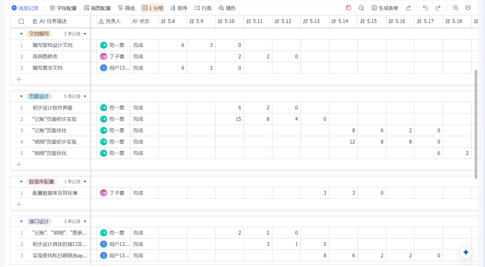
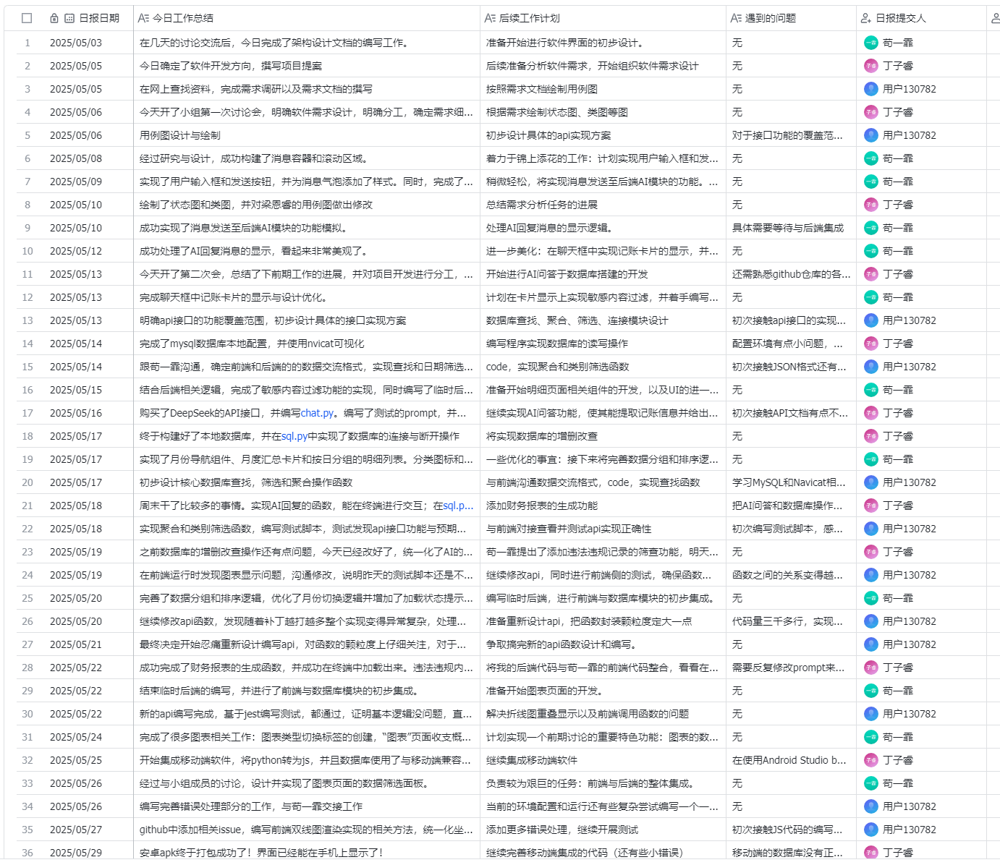
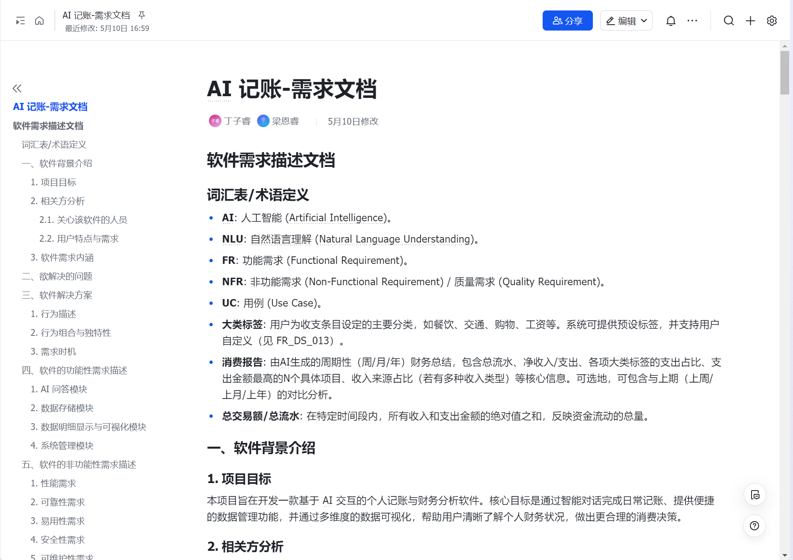
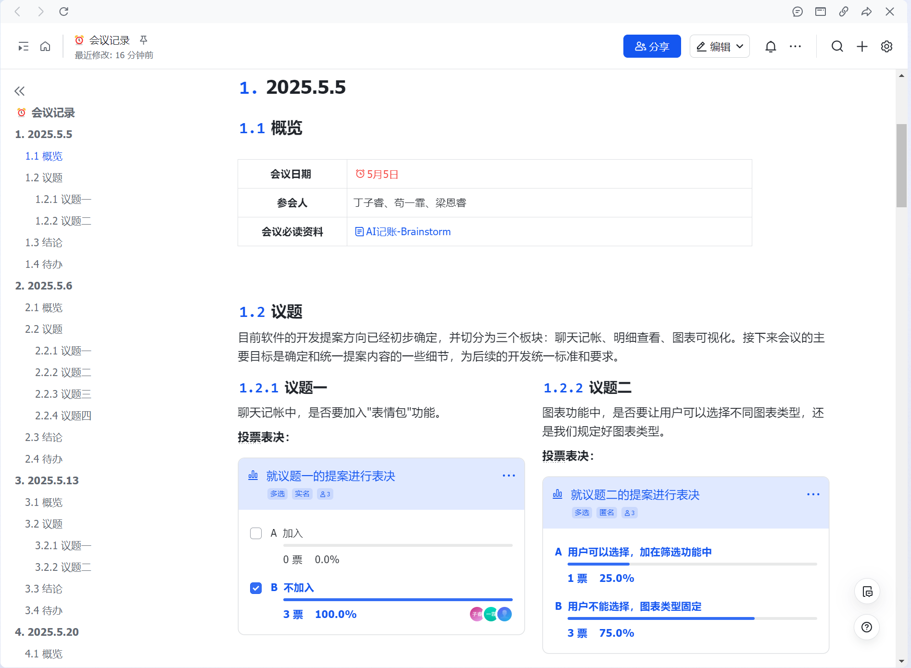

# AIccounting 软件工程化说明文档


## 一、项目简介

本项目旨在提供一站式的个人财务管理解决方案，用户可以通过与AI助手自然语言对话的方式记录日常收支，系统会自动分类并保存数据。


## 二、软件工程化目标

### 1. 实现多端协作与高效开发

AIccounting项目的首要工程化目标是建立一个支持Web端和移动端无缝协作的开发环境，促进前端和后端开发者的高效协作。通过统一的接口规范和标准化的数据交换格式，降低跨团队沟通成本。同时，提高代码复用率，减少重复劳动，使得各端功能开发能够并行进行而不相互阻塞，最终实现开发周期缩短和人力资源优化配置。

### 2. 回归测试保障系统质量

项目质量保障的核心目标是构建全方位的回归测试体系。旨在确保每一个代码变更都不会破坏已有功能，新功能的加入符合预期设计。通过全面的测试覆盖，及早发现和修复潜在问题，降低生产环境故障风险。目标是建立从单元测试、集成测试到性能测试的完整回归测试链路，形成代码质量的坚实防线，使开发团队能够自信地进行代码重构和功能扩展，保证系统的长期可维护性和稳定性。

### 3. 简化打包与部署流程

高效的交付流程是项目的重要目标之一。致力于简化从开发到部署的全过程，消除手动操作环节，降低人为错误的可能性。目标是实现一键式构建和部署，使得新版本的发布变得简单、可靠且可重复。同时确保各环境间的一致性，消除"在我的机器上能运行"的问题，提升发布频率和质量，更快地将新功能和改进交付给用户。

### 4. 支持多人协作开发与问题追踪

项目的协作目标是建立一个透明、高效的团队协作环境。通过规范的版本控制和问题追踪机制，使每一项开发任务都有明确的责任人和截止日期，每一个问题都能被准确记录和跟踪。目标是提升团队的可视化管理水平，使项目进度和决策过程对所有成员可见，促进知识共享和技能提升。同时建立完善的文档体系，降低新成员的入职成本，保障团队人员变动时的平稳过渡。


## 三、项目结构与模块划分

### 项目总体架构

AIccounting项目采用清晰的目录结构组织代码，各模块职责明确，便于团队协作和维护。项目整体目录结构如下：
```
AIccounting/
├── AIccounting-main/        # Web后端
│   ├── api.py
│   ├── chat.py
│   ├── main.py
│   ├── sql.py
│   ├── tests/
│   │   ├── locustfile.py
│   │   ├── locustfile_extreme.py
│   │   ├── run_tests.py
│   │   └── test_api.py
│   └── 文档/
├── App/                     # Web前端
│   ├── build/
│   ├── config/
│   ├── src/
│   │   ├── components/
│   │   ├── router/
│   │   ├── views/
│   │   ├── App.vue
│   │   └── main.js
│   ├── test/
│   │   ├── unit/
│   │   │   ├── jest.conf.js        
│   │   │   ├── setup.js           
│   │   │   ├── coverage/            
│   │   │   └── specs/               
│   │   └── e2e/                   
│   └── 测试/
├── App-Mobile/              # 移动端
│   ├── cordova/
│   ├── platforms/
│   ├── plugins/
│   ├── src/
│   └── www/
├── 文档/
├── 使用说明.md
```

项目包含以下主要模块：
1. AIccounting-main/：网页端后端代码，采用Python语言开发的服务端应用。该目录包含核心业务逻辑、数据库操作、API服务和AI交互组件。其中main.py是程序入口，负责初始化系统组件；api.py提供RESTful API接口，处理前端请求；sql.py封装了数据库访问逻辑；chat.py实现与AI助手的交互功能。后端代码遵循模块化设计原则，各组件间通过清晰的接口通信，降低耦合度。测试目录包含单元测试、API测试和性能测试用例，确保代码质量和系统稳定性。

2. App-Mobile/：移动端代码，基于Vue3和Cordova开发的跨平台移动应用。该目录采用现代前端工程结构，包含src/源代码目录、platforms/平台特定代码、plugins/Cordova插件和www/构建输出目录。源代码按功能模块组织，包括components/可复用组件、views/页面视图、services/服务层、router/路由配置等。移动端应用主要实现了轻量级的记账和查询功能，采用LocalForage本地存储数据，确保用户隐私安全，同时提供良好的离线使用体验。

3. App/：网页端前端代码，使用Vue.js框架构建的Web应用。该目录结构包含src/源代码、build/构建配置、config/环境配置和static/静态资源等。前端应用实现了完整的用户界面，包括聊天式记账界面、明细查询页面和数据分析图表。通过组件化开发和路由管理，实现了页面间的无缝切换和状态管理。前端代码还集成了自动化测试框架，包括单元测试和集成测试，确保UI组件和业务逻辑的正确性。

各子目录均遵循统一的组织结构，包含模块说明、接口定义、依赖配置等信息，确保代码的可读性和可维护性。项目整体采用分层设计，前后端通过RESTful API进行通信，移动端和Web端共享相同的后端服务，保证数据一致性和业务逻辑的统一。

### 代码质量保障体系

#### 1. 注释标准规范

项目采用统一的注释规范，确保代码的可读性和可维护性。Python后端代码使用Google风格的docstring，清晰描述模块、类和函数的功能、参数和返回值。每个Python文件顶部都有模块级注释，说明该模块的用途和责任范围。核心函数和复杂逻辑都附有详细的行内注释，解释算法思路和实现细节。

前端JavaScript代码采用JSDoc风格的注释，为组件、方法和属性提供类型信息和使用说明。Vue组件文件中的template、script和style部分都有对应的注释，说明组件的用途、参数和事件。关键业务逻辑和复杂UI交互都有清晰的注释说明，帮助开发者理解代码意图。

项目还建立了注释审查机制，作为代码审查流程的一部分，确保新增代码符合项目的注释规范。这种一致性的注释风格大大提高了团队协作效率和代码可维护性。

#### 2. 面向对象编程思想

项目在设计和实现过程中充分应用了面向对象编程原则，提高代码的可扩展性和可维护性。后端Python代码中，核心业务逻辑被封装为类，如MySQLDataStore封装数据库操作，AIAccountant封装AI交互逻辑，每个类都有明确的职责和封装的属性方法。系统遵循单一职责原则和依赖倒置原则，减少组件间的耦合。

前端Vue组件同样采用面向对象的设计思想，每个组件都是一个封装良好的对象，包含自己的状态、行为和生命周期方法。服务层代码采用类的形式组织，如API服务类、数据处理类等，通过依赖注入的方式提供给组件使用。这种设计方式使得代码结构清晰，易于理解和维护。

项目还应用了接口抽象和多态性等面向对象概念，为不同功能实现提供统一接口，增强了系统的灵活性和可扩展性。例如，数据存储层定义了统一的接口，可以轻松切换不同的数据库实现，而不影响业务逻辑层。

#### 3. 代码覆盖率分析

代码覆盖率是衡量软件测试质量的重要指标，反映了测试用例对源代码的执行程度。AIccounting项目建立了覆盖率分析体系，确保代码质量和测试充分性。

前端采用Jest框架内置的Istanbul覆盖率工具，配置在`jest.conf.js`中，通过`npm run unit`命令执行测试时自动生成覆盖率报告。报告包括语句覆盖率、分支覆盖率、函数覆盖率和行覆盖率四个维度，并以HTML格式保存在`test/unit/coverage/`目录下，提供直观的可视化界面帮助开发者识别测试盲区。后端采用unittest框架，通过`run_tests.py`脚本统一执行测试用例，确保核心业务逻辑的功能正确性。

## 四、测试体系与质量保障

AIccounting项目建立了针对前后端的完整测试体系，确保系统质量和功能正确性。项目遵循测试金字塔原则，在前端和后端分别建立了相应的测试框架和策略。

### 1. 后端测试体系

后端采用Python的unittest框架进行测试，测试用例覆盖核心业务逻辑、数据库操作和API接口。测试采用AAA（Arrange-Act-Assert）模式组织，使测试用例结构清晰：

```
AIccounting-main/tests/
├── test_sql.py          # 数据库操作测试
├── test_api.py          # API接口测试  
├── test_date_utils.py   # 工具函数测试
├── test_main.py         # 主程序逻辑测试
└── run_tests.py         # 测试套件执行器
```

通过mock技术实现了对外部依赖（如数据库、第三方API）的隔离，确保测试的可靠性和可重复性。测试执行通过统一入口`python tests/run_tests.py`进行，该脚本自动发现并执行所有测试用例，生成详细的测试结果反馈。

### 2. 前端测试体系

前端采用Jest框架进行组件测试和单元测试，测试配置位于`App/test/unit/jest.conf.js`。前端测试结构如下：

```
App/test/
├── unit/
│   ├── jest.conf.js     # Jest配置文件
│   ├── setup.js         # 测试环境设置
│   ├── specs/           # 测试用例
│   └── coverage/        # 覆盖率报告
└── integration/         # 集成测试
```

通过Vue Test Utils库，实现了对组件渲染、事件处理和状态变更的测试，确保UI组件的功能正确性。Jest配置支持对Vue组件的覆盖率统计，通过`npm run unit`命令执行测试时自动生成覆盖率报告，HTML格式的报告保存在`test/unit/coverage/`目录下。

### 3. 性能测试与压力测试

项目引入Locust框架进行性能测试，主要针对后端API接口进行压力测试：

```
AIccounting-main/tests/
├── locustfile.py         # 常规性能测试
├── locustfile_extreme.py # 极限压力测试
└── performance_reports/  # 性能测试报告
```

**常规性能测试**模拟正常业务流程下的用户行为，包括记账操作、数据查询等核心接口。**极限压力测试**对关键接口进行高并发测试，识别系统瓶颈和验证容灾能力。

### 4. 回归测试与代码质量保障

项目建立了完整的回归测试流程，确保代码变更不会破坏已有功能。后端部分每次代码提交前执行完整的单元测试和API测试，通过`run_tests.py`脚本统一管理测试执行。前端部分通过Jest框架执行组件测试，验证UI交互的正确性和组件状态管理的稳定性。同时还配备了集成测试，验证前后端接口的契约一致性，确保API调用和数据传输的正确性。通过这套分层的测试体系，项目能够及早发现和修复问题，保障前端用户体验和后端服务稳定性。

## 五、软件构建与部署

### 1. 构建工具与流程

项目采用现代化的构建工具和流程，提高开发效率和部署一致性。Web前端采用webpack进行模块打包和资源优化，支持ES6+语法、CSS预处理器和静态资源管理。构建配置分为开发环境（`webpack.dev.conf.js`）和生产环境（`webpack.prod.conf.js`），分别优化了开发体验和生产性能。

移动端采用更现代的Vite构建工具，提供更快的启动速度和热更新体验。项目通过npm scripts定义了一系列便捷的命令，如`npm run dev`启动开发服务器，`npm run build`构建生产版本。Cordova集成使得前端代码可以无缝打包为原生移动应用，支持Android平台。构建过程自动处理依赖关系、代码转译和资源优化，生成高性能的应用程序。

自动化构建流程不仅标准化了从源代码到可部署产物的转换过程，也确保了构建结果的一致性和可重现性。每次构建都会执行代码检查、回归测试和资源优化，只有通过所有检查的代码才能进入下一阶段，有效防止了问题代码的引入。

### 2. 依赖管理与版本控制

依赖管理是项目工程化的重要环节，AIccounting项目对此进行了规范化处理。前端项目使用`package.json`管理JavaScript依赖，明确指定了每个包的版本号，确保开发环境的一致性。核心运行时依赖如Vue、Chart.js、Axios等与开发依赖如webpack、Babel、ESLint等都在配置文件中详细列出。通过npm的锁定文件（`package-lock.json`），进一步确保了依赖树的稳定性。

后端Python依赖通过`requirements.txt`文件管理，列出了所有必要的库及其版本，如Flask、pymysql、pandas等。开发团队统一使用虚拟环境（venv或conda）隔离项目依赖，防止系统级Python环境的污染和冲突。这种方式确保了每个开发者和生产环境使用完全相同的依赖版本，减少了"在我电脑上能运行"的问题。

构建工具方面，项目选择了适合各部分特点的最佳工具：Web前端使用webpack进行模块打包和资源优化，移动端使用Vite提供更快的构建体验，后端使用Python原生模块系统组织代码。这些工具都配置了适合项目需求的设置，如代码分割、懒加载、CSS提取和图像优化等，确保最终产物的高效运行。

## 六、协作化开发实践

### 1. 代码管理与版本控制

AIccounting项目采用Git作为版本控制系统，所有源代码和配置文件均托管在GitHub仓库(https://github.com/Lem0npieee/AIccounting)。项目实施了规范的分支管理策略，确保代码管理的有序性和可追溯性。仓库采用主分支`main`和开发分支`develop`并行管理，同时每位成员根据开发任务创建个人功能分支，命名格式为`feature/成员名`。开发完成后先合并回`develop`，经过团队测试和review后统一合并到`main`，以保证主分支的稳定性。

团队成员在每次代码提交时都会提供相关说明，描述本次提交的主要内容和目的。当功能开发完成后，开发者创建Pull Request，详细描述所做的更改、解决的问题和测试结果。团队成员进行Code Review，检查代码质量、功能实现和测试覆盖等方面，只有通过审核的代码才能合并到目标分支。这一流程不仅提高了代码质量，也促进了知识共享和团队协作。


项目采用分布式协作开发模式，各端代码开发相对独立但有序协作。网页端后端代码集中在`AIccounting-main`目录下，移动端开发工作则位于`App-Mobile`目录。团队成员在本地完成功能开发和测试后，通过Git分支管理和Pull Request流程将代码变更提交到远程仓库，确保所有代码变更都经过团队协作和审核。


### 2. 飞书协作与团队管理

飞书是团队核心的协作与运维支撑平台，承载了项目管理、进度跟踪、经验归档等多项关键功能。团队充分利用飞书的文档、群聊、表格、任务、日历等多种工具，将日常协作和运维保障体系化、流程化。

任务分工与项目职责记录方面，团队通过飞书表格对所有开发与运维任务进行结构化记录。表格内容包括任务描述、优先级、负责人、起止日期、实际完成时间、工时等关键信息。通过这种方式，团队能够实时掌握各项任务的执行情况，及时调整资源分配，提升项目管理效率。


开发进度与甘特图管理方面，团队通过飞书甘特图对项目开发进度进行可视化管理。甘特图详细记录了每项任务的起止时间、实际完成情况、负责人及任务之间的依赖关系。通过甘特图，团队能够直观了解各阶段任务的进展、重叠与衔接，及时发现进度风险和资源冲突。


**敏捷燃尽图工作表管理**方面，团队采用基于敏捷开发方法论的燃尽图（Burndown Chart）工作表进行冲刺管理和工作量跟踪。燃尽图是Scrum框架中的核心项目管理工具，通过横轴表示时间进度、纵轴表示工作任务。该工作表包含任务及其状态、负责人分配、时间轴跟踪和工作剩余时间估算等关键要素，为团队提供透明度提升、风险预警、自我管理和交付预测等核心价值，在迭代回顾、风险管控等敏捷实践中发挥重要作用，体现了团队采用数据驱动的项目管理方式。



日志与周报记录方面，团队通过飞书表格每日记录工作日志，内容包括当天工作总结、后续工作计划、遇到的问题、日报提交人等关键信息。通过日报的持续积累，团队能够追踪项目进度、发现和解决开发过程中的实际问题，同时为后续的周报、绩效评估和经验总结提供详实的数据支撑。



### 3. 文档协作与知识管理

完善的文档是项目成功的关键因素之一，AIccounting项目建立了基于飞书云文档的协作文档体系，支持团队成员共同编写和维护项目文档。团队在飞书平台上协作编写了完整的项目文档集，包括需求文档、架构设计文档、软件工程化文档、配置与运维文档等核心文档。

通过飞书云文档的实时协作功能，团队成员可以同时编辑文档、添加评论、跟踪修改历史，实现了文档编写的高效协作。所有项目相关的技术文档、设计决策和规范标准都统一在飞书文档中管理，确保团队成员能够及时获取最新的项目信息和技术规范。

会议纪要与决策归档方面，每次团队讨论或例会，均在飞书文档中记录会议纪要。纪要内容包括会议主题、讨论要点、决策结论和后续待办事项等。所有重要的技术决策、需求变更、风险识别等内容都会被详细归档，方便后续追踪和查阅。

通知、反馈与应急响应方面，团队日常沟通、任务通知、问题反馈依赖微信或飞书群聊进行。每当有需求变更、bug紧急修复或遇到故障时，相关成员会在飞书群第一时间同步信息，确保全员及时响应。团队也会在飞书群内定期提醒大家按时提交日志、更新进度或填写周报。

### 4. 代码备份与故障处理

团队采用"本地备份 + 远程仓库"双保险策略确保代码安全。每位成员需定期将当前开发代码在本地保存一份，同时所有代码和配置都推送到GitHub的各自仓库。通过Git版本历史，团队可以随时回溯到任意时间点的项目状态。

当项目开发或运行过程中出现严重bug或故障，发现问题的成员会在飞书群内详细描述问题表现、影响范围和初步判断，团队协作定位原因。若需回退，团队利用Git的历史版本功能回滚到上一个稳定提交，确保系统能够快速恢复正常运行状态。

## 七、技术栈与系统架构

### 1. 核心功能与特性

1. 智能记账对话：用户通过自然语言与AI助手交流，描述收支情况。系统利用先进的自然语言处理技术，准确理解用户意图，自动提取金额、类别、时间等关键信息，并将其转换为结构化的记账数据。

2. 跨平台支持：项目支持Web端和移动端两种使用方式。Web端提供完整的功能体验，包括详细的数据分析和图表展示；移动端提供便捷的记账入口，支持随时随地进行财务记录。

3. 数据可视化与统计分析：系统提供多种图表展示用户的财务状况，包括月度收支趋势图、收支类别占比饼图等。用户可以直观地了解自己的消费习惯和财务健康状况，并根据分析结果进行财务规划。

4. 支持本地存储与隐私保护：移动端应用采用LocalForage本地存储所有交易记录，无需将敏感财务数据上传至云端，有效保障用户的数据隐私。Web端也确保数据传输和存储的安全性，严格控制数据访问权限。

### 2. 技术栈架构

**Web 后端技术栈**：
- **开发语言**：Python 3.11
- **Web框架**：Flask（提供RESTful API服务）
- **数据库**：MySQL 8.0（关系型数据库）
- **数据库驱动**：pymysql
- **AI服务集成**：DeepSeek等第三方AI服务API
- **核心依赖**：Flask、Flask-CORS、OpenAI、pandas等

**Web 前端技术栈**：
- **开发框架**：Vue.js 2.x
- **构建工具**：webpack（模块打包和资源优化）
- **开发工具**：webpack-dev-server（开发环境）
- **测试工具**：Jest + Vue Test Utils
- **数据可视化**：Chart.js
- **HTTP客户端**：Axios

**移动端技术栈**：
- **开发框架**：Vue3
- **跨平台方案**：Cordova（支持Android平台）
- **构建工具**：Vite（快速启动和热更新）
- **本地存储**：LocalForage（IndexedDB/WebSQL/localStorage）
- **数据可视化**：Chart.js
- **构建脚本**：npm scripts + Cordova CLI

### 3. 环境与部署架构

**多环境支持**：
- **开发环境**：本地调试环境，支持热更新和实时调试
- **测试环境**：团队共享服务器，用于集成测试和功能验证
- **生产环境**：正式对外服务环境，优化性能和安全性

**部署策略**：
- **Web端部署**：构建产物上传至服务器，支持静态资源CDN加速
- **移动端部署**：构建Web资源后使用Cordova打包生成APK
- **配置管理**：Web端和移动端配置完全分离，独立维护

### 4. 依赖管理策略

**前端依赖管理**：
- 使用`package.json`统一管理JavaScript依赖
- 明确指定版本号，确保环境一致性
- 通过`package-lock.json`锁定依赖树
- 区分运行时依赖和开发依赖

**后端依赖管理**：
- 使用`requirements.txt`管理Python依赖
- 统一使用虚拟环境（venv/conda）隔离项目依赖
- 防止系统级Python环境污染
- 确保开发和生产环境依赖版本一致


## 八、总结

### 1. 当前成果与进展

AIccounting项目通过系统的软件工程实践，已经建立了一套完整的开发、测试和协作体系。在回归测试方面，项目实施了全面的单元测试、集成测试和性能测试，为代码质量提供了有力保障。在协作开发方面，规范的Git分支管理策略和Pull Request流程促进了团队协作和代码审查，提高了代码质量和知识共享。在依赖与构建管理方面，项目采用了现代化的工具链和标准化的配置，确保了开发环境的一致性和构建过程的可靠性。

项目的模块化架构设计使得各组件职责清晰，接口明确，便于并行开发和维护。完善的文档体系为团队成员提供了必要的指导和参考，降低了学习成本和沟通障碍。这些工程化实践不仅提高了开发效率，也保证了产品的质量和用户体验。

### 2. 未来改进方向

项目已经具备良好的工程化基础，当前的测试体系、构建流程和协作机制能够满足团队的开发需求。项目将根据实际使用情况和团队反馈，持续优化现有的工程化实践。

总之，AIccounting项目已经建立了良好的软件工程化基础，通过持续改进和最佳实践的引入，项目的工程化水平将进一步提升，为产品的长期成功奠定坚实基础。

