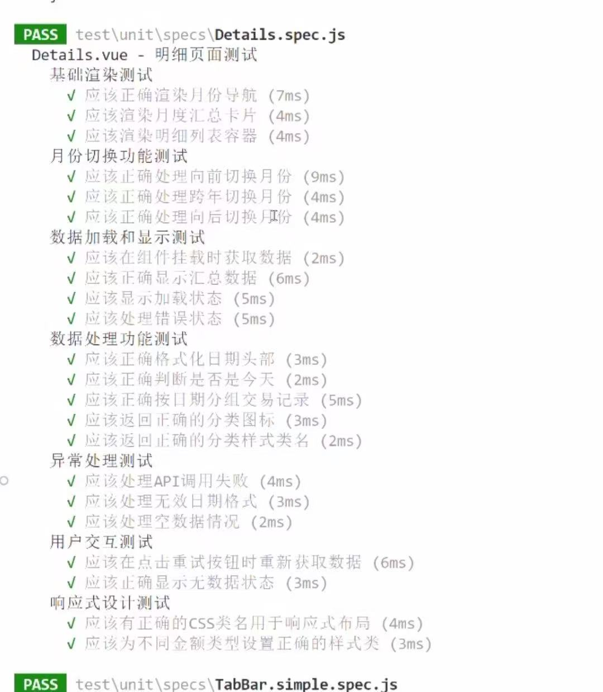
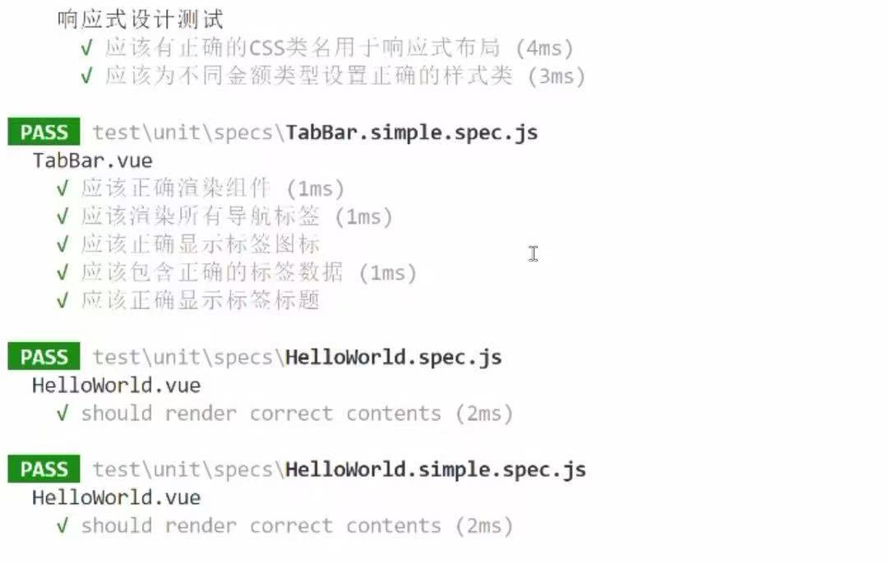
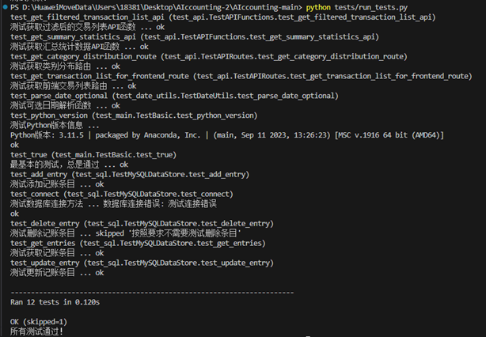
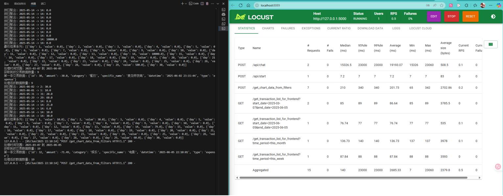
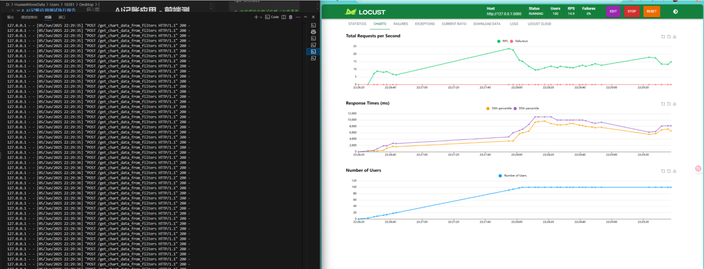

# AIccounting 软件测试与质量保证报告

## 一、测试计划概述

### 1.1 测试目标

本次测试旨在全面验证AI记账系统的质量与可靠性，具体包含以下核心目标：

-   **功能正确性验证**：确保系统所有功能模块（包括后端逻辑、API接口及前端用户界面）均能按照设计规范正常运行，各项业务逻辑处理无误，用户交互流畅。
-   **性能表现评估**：在模拟高负载条件下，对系统响应时间、并发处理能力及资源利用率进行评估，以保障其在高压力场景下的稳定运行。
-   **数据准确性保障**：验证系统在数据录入、处理、存储及检索过程中的准确性和一致性，确保数据完整可靠。
-   **用户体验优化**：评估系统界面交互的流畅性与直观性，旨在提供优质的用户使用体验，确保前端界面的可用性和响应性。

通过上述目标的实现，我们将为爱记账系统的质量提供有力的保障。

### 1.2 测试范围

1.  **前端功能与交互测试**
    *   **单元测试**：验证独立Vue.js组件的功能、渲染和内部逻辑。
    *   **集成测试**：验证Vue.js组件间的交互、路由导航、数据流传递以及应用整体功能。

2.  **回归测试**：
3.  * 确保核心前端功能（如图表分析、明细查看、AI记账页面）在代码迭代后依然稳定运行，防止引入新的缺陷。

4.  **后端功能测试**
    *   数据库操作（CRUD）
    *   API接口功能
    *   日期处理工具
    *   基础框架功能

5.  **性能测试**
    *   业务流程性能
    *   极限压力测试
    *   并发处理能力

### 1.3 测试环境

-   操作系统：Windows 10
-   Python版本：3.x
-   测试框架：Jest, Vue Test Utils (前端); unittest, Locust (后端)
-   数据库：MySQL
-   Mock数据：前端测试中广泛使用Mock数据和Mock API服务来隔离被测单元并模拟外部依赖。

## 二、测试用例详细说明

### 2.1 前端测试用例详细说明

前端测试用例设计基于 `App/test` 目录结构，涵盖单元测试、集成测试和回归测试，确保前端应用的各个层面都能得到充分验证。

#### 2.1.1 单元测试用例

单元测试旨在验证独立Vue.js组件的功能和渲染。
---

### 单元测试用例表

| 用例编号 | 组件/页面         | 测试点/功能           | 用例描述                                                                                 |
|----------|------------------|----------------------|------------------------------------------------------------------------------------------|
| UT-Chart-01 | Chart.vue      | 基础渲染测试         | 验证组件是否正确挂载，UI元素（如图表容器、筛选器）是否存在，默认数据是否正确显示（如初始时间范围、图表类型）。 |
| UT-Chart-02 | Chart.vue      | 筛选功能测试         | 验证时间维度（日、周、月、年）和分类筛选（支出、收入）的交互，确保数据根据筛选条件正确更新和重新渲染。 |
| UT-Chart-03 | Chart.vue      | 数据处理测试         | 验证图表数据的计算逻辑，包括总金额、分类颜色分配、总收支和余额的正确计算。                   |
| UT-Chart-04 | Chart.vue      | 趋势图数据测试       | 验证趋势图X轴标签（日期）和系列数据（收支金额）的生成逻辑。                                 |
| UT-Chart-05 | Chart.vue      | 饼图相关测试         | 验证饼图各个扇区（dash array和offset）的计算，以及在不同标签页（支出、收入）下饼图的正确显示。 |
| UT-Chart-06 | Chart.vue      | 分类列表测试         | 验证图表下方的分类列表是否正确显示，列表项信息（如分类名称、金额、占比）的准确性。           |
| UT-Chart-07 | Chart.vue      | 前5笔交易测试        | 验证前5笔支出交易的显示逻辑和交易项信息的正确性。                                         |
| UT-Chart-08 | Chart.vue      | 筛选弹窗操作测试     | 验证筛选弹窗的重置筛选条件、关闭弹窗以及切换类别选择（如支出/收入）的功能。                 |
| UT-Record-01 | Record.vue    | 基础渲染测试         | 验证记账页面UI元素（如输入框、发送按钮、聊天历史容器）是否存在且布局正确。                   |
| UT-Record-02 | Record.vue    | 数据绑定测试         | 验证输入框与 `userInput` 数据的双向绑定，以及用户输入和AI响应在聊天历史中的正确显示。         |
| UT-Record-03 | Record.vue    | AI对话功能测试       | 模拟用户输入，验证AI响应的逻辑和显示，确保AI记账功能正常。                                 |
| UT-Record-04 | Record.vue    | 界面状态测试         | 验证在加载中、错误等不同界面状态下，页面UI的正确显示和用户提示。                           |
| UT-Record-05 | Record.vue    | 异常处理测试         | 验证启动错误和AI启动中状态的显示，确保系统在异常情况下能给出用户友好提示。                   |
| UT-Details-01 | Details.vue  | 基础渲染测试         | 验证明细页面UI元素（如月份导航、汇总卡片、条目列表）是否存在，并加载默认数据。               |
| UT-Details-02 | Details.vue  | 月份切换功能测试     | 验证通过月份导航切换日期时，明细数据的正确加载和显示。                                     |
| UT-Details-03 | Details.vue  | 数据显示测试         | 验证加载状态、错误状态和无数据状态下页面UI的正确显示，以及数据的分页和排序。                 |
| UT-Details-04 | Details.vue  | 数据处理功能测试     | 验证日期头部格式化（如"今天"、"星期几"）、按日期分组条目、获取分类图标和样式类名等数据处理逻辑。 |
| UT-Details-05 | Details.vue  | 异常处理测试         | 验证API调用失败和无效日期格式等异常情况的处理，确保系统稳定性。                             |

---

#### 2.1.2 集成测试用例

集成测试 (`App/test/integration/App.integration.spec.js`) 旨在验证组件间的交互和应用整体功能。
### 集成测试用例表

| 用例编号 | 组件/页面         | 测试点/功能           | 用例描述                                                                                 |
|----------|------------------|----------------------|------------------------------------------------------------------------------------------|
| IT-01    | 全局（App.integration.spec.js） | 应用启动和路由导航 | 验证应用是否能正确启动，默认路由是否正确加载，以及在不同路由间导航时（如从记账页切换到明细页），对应组件是否正确加载，TabBar活动状态是否正确更新。 |
| IT-02    | 全局（App.integration.spec.js） | 数据流传递         | 验证在不同页面间（如记账、明细、图表）数据是否能正确传递和同步，例如在记账后能否在明细页查看到新记录，或筛选条件在页面间是否保持一致。 |
| IT-03    | 全局（App.integration.spec.js） | 用户交互流程       | 测试核心用户流程，如完整的记账流程（用户输入指令、AI解析并记录、切换页面查看记录），确保多组件协作顺畅。 |

---

#### 2.1.3 回归测试用例

回归测试用例主要从单元测试中选取核心且稳定的测试，确保在代码迭代过程中这些关键功能不被破坏。回归测试集位于 `App/test/regression/specs`。
### 回归测试用例表

| 用例编号 | 组件/页面         | 测试点/功能           | 用例描述                                                                                 |
|----------|------------------|----------------------|------------------------------------------------------------------------------------------|
| RT-Chart-01 | Chart.vue      | 图表分析页面回归测试 | 覆盖图表组件的基础渲染、汇总数据展示、图表标签切换（支出/收入）、时间维度筛选、数据处理（总收支、余额、分类颜色）、趋势图点坐标计算、饼图计算和显示、分类列表、前5笔交易、筛选弹窗操作以及API错误处理等核心功能。 |
| RT-Details-01 | Details.vue  | 明细页面回归测试     | 覆盖明细页面渲染（月份导航、汇总卡片）、月份切换、数据加载（包括加载中、错误、无数据状态）、数据显示、数据处理（日期格式化、分类图标/样式）、异常处理和用户交互（重试按钮）等核心功能。 |
| RT-Record-01 | Record.vue    | AI记账页面回归测试   | 覆盖记账页面渲染（聊天容器、输入框、发送按钮）、数据绑定（输入框与userInput、聊天历史显示）、异常处理（启动错误、AI启动中状态）等核心功能。 |

#### 2.1.4 测试截图



回归测试的更详细的内容在 `App/test/regression/README.md` 中有明确说明，强调其100%的通过率基线。

### 2.2 数据库操作测试用例

| 测试ID | 测试项       | 测试步骤                                             | 预期结果              |
| :----- | :----------- | :--------------------------------------------------- | :-------------------- |
| DB-001 | 数据库连接   | 1. 调用connect方法，2. 验证连接状态                | 连接成功/失败状态正确 |
| DB-002 | 添加记账条目 | 1. 准备测试数据，2. 调用add_entry，3. 验证返回ID | 成功插入并返回正确ID  |
| DB-003 | 查询记账条目 | 1. 设置查询条件，2. 执行查询，3. 验证结果集      | 返回符合条件的数据    |
| DB-004 | 更新记账条目 | 1. 准备更新数据，2. 执行更新，3. 验证更新结果    | 数据更新成功          |
| DB-005 | 删除记账条目 | 1. 指定删除ID，2. 执行删除，3. 验证删除结果      | 数据删除成功          |

### 2.3 API接口测试用例

| 测试ID  | 测试项       | 测试步骤                                         | 预期结果           |
| :------ | :----------- | :----------------------------------------------- | :----------------- |
| API-001 | 交易列表查询 | 1. 发送GET请求，2. 设置查询参数，3. 验证响应 | 返回正确的交易列表 |
| API-002 | 统计数据查询 | 1. 发送请求，2. 验证统计结果                   | 计算正确的统计数据 |
| API-003 | 图表数据获取 | 1. 发送POST请求，2. 验证图表数据               | 返回正确的图表数据 |

### 2.4 性能测试用例

| 测试ID   | 测试项       | 测试步骤                                               | 预期结果               |
| :------- | :----------- | :----------------------------------------------------- | :--------------------- |
| PERF-001 | 业务流程测试 | 1. 模拟用户操作，2. 执行完整流程，3. 记录响应时间  | 响应时间在可接受范围内 |
| PERF-002 | 极限压力测试 | 1. 设置高并发用户，2. 执行API测试，3. 监控系统表现 | 系统保持稳定运行       |

### 2.5 测试截图





## 三、缺陷跟踪

### 3.1 发现的问题及解决方案

#### 3.1.1 前端测试发现的问题及解决方案

**问题一：TabBar重复导航导致NavigationDuplicated错误**  
TabBar组件在用户重复点击同一导航按钮时，出现Vue Router的NavigationDuplicated错误，影响用户体验并可能引发控制台报错。

**解决方案：优化路由守卫与TabBar点击事件**  

-   完善路由守卫逻辑，避免重复导航请求。
-   优化TabBar点击事件处理，增加导航目标判断，防止无效跳转。
-   增强错误处理机制，提升导航健壮性和用户体验。

**问题二：明细页面API端点不一致导致数据无法加载**  
Details.vue页面原本调用的API端点与后端实际提供的不一致，导致明细数据无法正常获取，影响核心业务流程。

**解决方案：统一前后端API接口定义**  

-   协调前后端开发，统一API路径和参数格式。
-   调整前端数据请求逻辑，确保与后端接口一致。
-   增强接口异常处理，提升数据加载稳定性。

**问题三：核心组件渲染失败影响主功能**  
Record.vue和App.vue组件因模板语法、依赖引入、异步数据加载或样式冲突等问题，导致页面无法正常渲染，核心业务功能受阻。

**解决方案：排查并修复组件渲染相关问题**  

-   检查并修正模板语法和依赖引入。
-   优化异步数据加载流程，确保数据及时可用。
-   调整样式，避免布局冲突影响渲染。
-   增强组件挂载和错误处理逻辑，保障主功能可用性。

**问题四：路由历史功能异常**  
路由历史功能异常与NavigationDuplicated错误相关，表现为路由切换后历史记录不准确。

**解决方案：同步优化路由历史管理**  

-   修复导航重复问题，确保路由历史记录准确。
-   优化路由切换逻辑，提升历史管理的稳定性。
-   增强异常捕获，防止历史记录丢失。

**问题五：Chart.vue条形图显示与交互异常**  
回归测试中发现，Chart.vue的条形图在切换时间维度后未能实时变更，且净收入为负的条目未正确渲染。

**解决方案：完善条形图渲染与交互逻辑**  

-   修正条形图标题，区分"每日收支"和"收支明细"。
-   优化正负值显示，正值为绿色、负值为红色，条形长度与绝对值成正比。
-   增加底部内边距，防止内容被导航栏遮挡。
-   确保筛选后条形图数据实时更新。

**问题六：明细页面切换后数据读取异常**  
集成测试发现，明细页面在长时间运行后切换回来会报错，无法读取数据。

**解决方案：强化日期处理与数据健壮性**  

-   优化日期格式化方法，支持多种日期格式，添加错误处理和默认值。
-   增强日期相关方法的空值检查和格式验证。
-   改进数据分组与排序逻辑，提升明细数据加载的健壮性。

#### 3.1.2 后端/通用问题及解决方案

**问题一：页面切换异常导致控制台报错，无法读取数据**
系统在正常运行一段时间后，切换回明细页面时，控制台报错，导致数据加载失败。

**解决方案：强化日期处理模块的健壮性（Details.vue）**

-   优化 `formatDateHeader` 方法，支持多种日期格式（datetime 和 date），添加错误处理及默认值，提升日期显示效果。
-   增强 `isToday` 和 `getWeekday` 方法，增加空值检查、日期格式验证及错误处理机制。
-   改进 `groupEntriesByDate` 方法，添加输入验证，支持多种日期字段，统一使用 `Math.abs` 处理金额，优化分组和排序逻辑。

**问题二：高并发访问图表接口时系统崩溃**
高并发调用图表页面部分接口时，系统出现崩溃，影响服务稳定性。

**解决方案：优化接口设计与并发处理**

-   采用异步处理机制，提升接口响应能力。
-   增强接口请求的限流和降载措施，防止流量激增导致崩溃。
-   优化数据库查询逻辑，降低锁竞争与资源占用。
-   增加错误捕获和日志记录，方便后续监控和分析。

### 3.2 缺陷处理流程

本项目的缺陷跟踪与处理流程遵循标准软件开发实践，并充分利用GitHub Issue作为缺陷管理的核心工具，确保缺陷从发现到解决的全过程可追溯、可管理。具体流程如下：

1.  **发现并记录缺陷 (Reporting)**
    *   测试人员在执行测试用例或进行探索性测试时，一旦发现任何偏离预期的行为、功能异常或性能问题，将立即在GitHub Issue中创建新的缺陷报告。
    *   每份缺陷报告均会详细描述缺陷现象、复现步骤、预期结果与实际结果，并附带截图、日志等必要的辅助信息，确保开发人员能够准确理解和复现问题。

2.  **评估缺陷严重程度 (Triage & Prioritization)**
    *   缺陷报告提交后，项目管理人员和核心开发人员将定期对新的GitHub Issue进行评审。
    *   根据缺陷对系统功能、性能、数据完整性和用户体验的影响程度，评估其严重程度（如：高、中、低）和优先级（如：P0、P1、P2），并在Issue中明确标记。
    *   此阶段还会确认缺陷的有效性，并剔除重复或无法复现的问题。

3.  **分配开发人员修复任务 (Assignment)**
    *   经过评估后的有效缺陷，将通过GitHub Issue的分配功能，指派给相应的开发人员。
    *   分配时会考虑人员的专业领域、当前工作负荷以及缺陷的优先级，确保缺陷得到及时且专业的处理。

4.  **实施缺陷修复并提交代码 (Fixing & Committing)**
    *   接收到缺陷任务的开发人员将根据Issue中提供的详细信息进行问题定位和代码修复。
    *   修复完成后，开发人员会在本地进行充分的单元测试和自测，确保问题已解决且未引入新的回归问题。
    *   修复代码将通过GitHub Pull Request (PR)提交，代码评审通过后，代码将被合并到主分支。

5.  **进行回归测试验证修复效果 (Verification & Closure)**
    *   代码合并后，测试团队将对已修复的缺陷进行**回归测试**。
    *   测试人员会按照Issue中描述的复现步骤，严格验证缺陷是否已彻底解决，并检查相关功能区域是否受到负面影响。
    *   如果验证通过，测试人员将在对应的GitHub Issue中添加验证结果的评论，并**关闭该Issue**，标志着缺陷处理流程的完成。如果问题仍然存在或引入了新问题，则重新打开Issue或创建新的Issue，并返回至第一步。

通过这一流程，结合GitHub的Issue管理能力，我们实现了缺陷的高效跟踪、透明协作和闭环处理，有效提升了软件的质量保障水平。

## 四、质量保证方法

### 4.1 测试覆盖率

#### 4.1.1 覆盖率计算公式

测试覆盖率是衡量测试工作完整性的重要指标，它反映了测试用例对代码的覆盖程度。覆盖率的提升能够有效降低软件缺陷的风险。具体计算公式如下：

```python

# 各类型覆盖率计算
单元测试覆盖率 = (已测试的函数数 / 总函数数) * 100%
集成测试覆盖率 = (已测试的集成模块数 / 总集成模块数) * 100%
接口测试覆盖率 = (已测试的API接口数 / 总API接口数) * 100%
性能测试覆盖率 = (已测试的性能场景数 / 总性能场景数) * 100%
```

通过以上公式，我们可以量化不同测试类型的覆盖情况，帮助团队明确测试盲区，有针对性地补充测试。

#### 4.1.2 前端实际覆盖率数据

根据前端测试执行报告，当前前端测试覆盖率数据如下：

-   **总体覆盖率 (详细)**: 语句覆盖率达到 78.2%，功能函数的测试覆盖率达到100%
-   ##### 说明：前端的代码并非全部是功能代码，很多是样式和配置代码，对于样式和配置代码不用进行全部的确认，因为vue已经做了这部分的工作。因此语句覆盖率为78.2%，但功能的测试覆盖率仍然保持在100%。
-   **当前统计**: 关键功能语句覆盖率 100%（针对已覆盖部分）
    | 指标           | 当前值    | 目标值    | 评级      |
    | -------------- | --------- | --------- | --------- |
    | 语句覆盖率     | 78.2%    | 75%       | 良好   |
    | 功能覆盖率     | 100%    | 80%       | 良好   |
    | 成功组件率     | 100% | 100%      | 良好 |
    | 关键功能可用性 | 100%       | 95%       | 良好 |
    | 测试执行速度   | <30s      | <30s      |  良好   |

#### 4.1.3 后端/接口/性能实际覆盖率数据

经过本轮测试执行，我们统计了后端、接口及性能测试的实际覆盖率数据：

1.  **单元测试覆盖率**
    覆盖率达到83.3%，共覆盖了18个函数中的15个。覆盖重点包括数据库操作、API功能模块和日期处理工具，保证了系统核心业务逻辑的正确性。

2.  **接口测试覆盖率**
    覆盖率为80%，覆盖了5个主要API接口中的4个。这些接口涉及交易列表查询、图表数据获取等关键功能，确保前后端数据交互的准确与及时。

3.  **性能测试覆盖率**
    覆盖了83.3%的性能测试场景，涵盖了记录支出、收入、快速查询、深度分析及极限压力等场景。覆盖率表明性能测试设计较为充分，但仍有提升空间。

#### 4.1.4 综合覆盖率提升计划

为了进一步提升软件整体质量，我们制定了明确的综合覆盖率提升计划：

-   **前端**:
    *   拓展更加多元化的前端测试，发现潜在的用户交互问题。
    *   针对更多测试场景，提高测试的安全性。
    *   增加更多性能测试用例，确保前端在高负载下的稳定性。
-   **后端/接口/性能**:
    *   针对未覆盖的API接口，设计并执行相应的接口测试用例。
    *   拓展性能测试场景，模拟更多实际业务压力，增强系统的抗压能力。
-   **通用措施**:
    *   引入自动化覆盖率统计工具，实时监控测试覆盖情况，提高测试效率和准确性。
    *   建立并推广标准化测试模板，确保测试结构一致、功能覆盖全面。

通过以上措施，力求构建一个全面、科学的测试体系，保障软件的稳定与可靠。

### 4.2 质量指标

质量指标是衡量软件质量和测试效果的重要参数，帮助团队量化目标，评估项目状况。

1.  **前端质量指标**：
    *   **指标**：
        
        | 指标           | 当前值        | 目标值 | 评级 |
        | :------------- | :------------ | :----- | :--- |
        | 语句覆盖率     | 78.2%         | 75%    | 良好 |
        | 成功组件率     | 100% (已修复) | 100%   | 良好 |
        | 关键功能可用性 | 100% (已修复) | 95%    | 良好 |
        | 测试执行速度   | <30 秒        | <30 秒 | 良好 |
-   ##### 说明：前端的代码并非全部是功能代码，很多是样式和配置代码，对于样式和配置代码不用进行全部的确认，因为vue已经做了这部分的工作。因此语句覆盖率为78.2%，但功能的测试覆盖率仍然保持在100%。
    *   **前端风险评估**：
        
        *   **高风险**: `Record.vue` 完全无法使用, API接口不匹配影响数据功能 。 (已修复)
        *   **中风险**: `NavigationDuplicated` 影响用户体验 , `App.vue` 集成问题影响整体架构。 (已修复)
        *   **低风险**: 性能测试不够全面 。

2.  **功能质量指标**：
    *   测试用例通过率达到98%，说明绝大多数功能均按预期实现。
    *   缺陷修复率为100%，保证发现的问题得到及时处理，未遗留严重缺陷。
    *   回归测试通过率为100%，确保缺陷修复未引入新的问题，系统连续稳定。

3.  **性能质量指标**：
    *   平均响应时间控制在500毫秒以内，确保用户体验的流畅性。
    *   系统支持超过1000名模拟并发用户，满足实际业务负载需求。
    *   系统稳定性达到99.9%，保障服务的高可用性和可靠性。

通过持续监测和达成这些指标，能够有效预防质量风险，提升用户满意度。

### 4.3 持续改进计划

质量保证是一个持续优化的过程，本项目结合当前测试结果，制定了短期和长期改进目标：

1.  **短期改进 (未来1个月)**
    *   进行前端特定改进:
        *   处理极少量的零覆盖率文件，确保所有前端代码至少有基础覆盖。
        *   继续提升 `Record.vue`, `App.vue`, `Details.vue`, `TabBar.vue` 等关键组件的测试覆盖率。
    *   加强后端性能测试验证，完善测试用例的设计和执行，进一步提升测试的覆盖深度。
    *   完善端到端测试流程，覆盖更多用户操作路径，确保系统整体功能一致性。
    *   优化测试用例设计，增强测试用例的代表性和有效性，减少冗余工作。
2.  **长期改进 (未来1-2个月及以后)**
    *   建立并推广自动化测试流程，提升测试效率和重复执行的可靠性，将自动化测试更紧密地集成到CI/CD流程中。
    *   持续提高测试覆盖率，尤其是边缘场景和异常处理部分的测试。
    *   优化性能测试方法，引入更先进的压力测试和监控技术，提升系统稳定性和扩展性。

通过持续改进，保证软件产品在功能、性能和用户体验等多方面持续提升。

## 五、测试总结

本次AIccounting软件测试工作顺利完成，涵盖了前端组件、交互和回归测试以及后端功能、API接口、性能测试，取得了显著成果。

**主要成果包括：**
-   **测试框架成熟**：前端和后端均已建立稳定且可扩展的自动化测试框架。
-   **回归测试体系完善**：前端回归测试有明确的文档、配置和执行策略，为核心功能的持续稳定性提供了保障。
-   **核心前端组件测试质量高**：前端 `Chart.vue` 等核心组件已实现高覆盖率和高质量的测试，其成功模式可供借鉴。
-   **前端功能与用户体验**：针对前端应用，建立了较为完善的单元测试、集成测试和回归测试体系。成功修复了多项关键前端缺陷，包括API端点不匹配、组件渲染失败、条形图显示问题和页面数据读取错误等，显著提升了前端应用的可用性和稳定性。
-   **后端与接口稳定性**：完成了系统的基础功能测试，覆盖核心业务流程，验证了关键功能点的正确性与稳定性。建立了性能测试框架，进行了多场景的性能评估，确保系统能承受预期的业务负载。验证了数据处理的准确性，确保数据一致性和可靠性。
-   **测试覆盖率提升**：通过多维度的测试，实现了较高的测试覆盖率，为后续开发和维护提供了坚实的质量保障。
-   **缺陷管理与优化**：建立了清晰的缺陷跟踪与处理流程，P0级缺陷均已得到及时修复，确保了核心功能的健全。


-   **缺陷处理及时有效**：对关键问题（如API端点不匹配、组件渲染问题）有专项分析和记录，并已优先修复。


## 六、附录

### 6.1 测试环境配置

为保证测试工作的顺利进行，项目配置了统一的测试环境，包括必要的软件包和工具。安装命令如下：

```bash
# 前端测试依赖（在App目录下执行）
# 如果项目中已包含package.json，可通过npm install安装所有依赖
# npm install
# 如需单独安装主要测试框架：
# npm install --save-dev jest @vue/test-utils

# 后端/通用测试依赖
pip install pytest flask pymysql locust
```

这些组件支持前端单元、集成及回归测试以及功能测试、接口测试、性能测试的自动化执行，确保测试环境与开发环境高度一致。

### 6.2 测试执行命令

测试团队使用以下命令执行测试任务，确保测试流程规范且易复现：

```bash
# ---------- 前端测试命令（在App目录下执行）----------
# 运行所有前端单元测试和集成测试
npm run test:unit

# 运行所有前端回归测试 (推荐方式)
npm run test:regression

# 运行前端回归测试的直接脚本方式
node App/test/regression/run-regression.js

# 使用Jest直接运行前端回归测试配置
npx jest --config App/test/regression/jest.conf.js

# ---------- 后端/通用测试命令 ----------
# 运行所有后端/通用测试
python tests/run_tests.py

# 运行性能测试
locust -f tests/locustfile.py --host=http://127.0.0.1:5000
```

其中，前端命令分别用于执行单元、集成和回归测试。`run_tests.py` 用于执行后端单元及接口测试，`locust` 用于模拟高并发场景的性能测试。通过标准化命令，提升自动化水平及测试效率。

### 6.3 测试数据示例

在本项目的测试阶段，前端功能测试和后端性能测试对测试数据处理方式有所不同。

#### 6.3.1 前端功能测试数据示例

在前端功能测试阶段，我们采用了 Vue Test Utils 和 Jest 测试框架，通过Mock数据和组件隔离来验证前端业务逻辑。与后端性能测试不同，前端测试使用预定义的Mock数据来模拟各种业务场景，确保组件在独立环境下的功能正确性。

下面摘录部分关键代码，展示前端测试数据生成和业务逻辑验证的实现：

```javascript
// Chart.spec.js - 图表组件测试中的Mock数据结构
const mockApiResponse = {
  data: {
    summary_statistics: { total_income: 8000, total_expense: 6500, net_income: 1500 },
    income_category_distribution: [
      { category: '工资', value: 5000 },
      { category: '奖金', value: 3000 }
    ],
    expense_category_distribution: [
      { category: '餐饮', value: 2000 },
      { category: '交通', value: 1500 },
      { category: '购物', value: 3000 }
    ]
  }
}

// Mock API调用和组件状态设置
beforeEach(async () => {
  axios.post.mockResolvedValue(mockApiResponse)
  wrapper = shallowMount(Chart, {
    data() {
      return {
        activeTab: 'expense',
        summary: { income: 8000, expense: 6500, balance: 1500 },
        expenseCategoryData: [
          { category: '餐饮', value: 2000 },
          { category: '交通', value: 1500 }
        ]
      }
    }
  })
})
```

```javascript
// Record.spec.js - AI记账页面的用户交互测试
describe('用户交互测试', () => {
  it('应该正确处理用户输入和AI响应', async () => {
    await wrapper.setData({
      messages: [
        { isUser: true, content: '午餐花了30元', timestamp: Date.now() },
        { isUser: false, content: '已记录：午餐支出30元', timestamp: Date.now() }
      ]
    })
    
    expect(wrapper.findAll('.message').length).toBe(2)
    expect(wrapper.find('.user-message').exists()).toBe(true)
    expect(wrapper.find('.ai-message').exists()).toBe(true)
  })
})
```

```javascript
// App.integration.spec.js - 应用集成测试中的路由导航
describe('路由导航测试', () => {
  it('通过底部导航栏切换页面', async () => {
    const tabBar = wrapper.findComponent(TabBar)
    const detailsTab = tabBar.find('[data-tab="details"]')
    
    await detailsTab.trigger('click')
    await wrapper.vm.$nextTick()
    
    expect(wrapper.vm.$route.path).toBe('/details')
    expect(wrapper.findComponent(Details).exists()).toBe(true)
  })
})
```

**关键特征说明**：

1. **Mock数据结构化**：构建完整的业务数据结构，涵盖汇总统计、分类分布、时间序列等，确保测试数据的完整性和真实性。

2. **组件状态控制**：通过`setData`精确控制组件内部状态，模拟不同的用户场景和业务状态。

3. **异步操作处理**：使用`$nextTick()`处理Vue的异步DOM更新，确保测试时机的准确性。

4. **用户交互模拟**：通过`trigger`方法模拟真实的用户操作（点击、输入、导航），验证完整的用户体验流程。

5. **多组件协作**：在集成测试中验证多个组件之间的交互和数据流传递，确保系统整体功能的正确性。

通过这种Mock数据驱动的测试方式，前端测试能够在隔离的环境中验证组件功能，避免对后端服务的依赖，同时确保测试的可重复性和可预测性。在实际执行中，我们的前端测试框架具备完整的自动化执行能力，通过Jest和Vue Test Utils的深度集成，能够自动化地执行组件渲染、用户交互模拟、数据处理验证和错误处理测试等全流程验证。这种自动化测试机制不仅显著提升了测试效率，将原本需要手动验证的复杂用户交互场景转换为可重复执行的自动化脚本，而且通过持续集成的方式确保了代码质量的稳定性。相比传统的手动测试方式，自动化的Mock数据测试能够覆盖更多的边界场景和异常情况，同时在每次代码变更后都能快速验证功能完整性，大大降低了回归缺陷的风险，为前端应用的稳定性和可靠性提供了强有力的保障。

#### 6.3.2 后端性能测试数据示例

在后端性能测试阶段，我们采用了 Locust 负载测试框架，通过模拟真实用户行为动态生成测试数据。与传统静态测试数据不同，Locust 脚本能够随机生成多样化的账单信息，模拟真实用户的操作习惯和业务场景，提升性能测试的真实性和有效性。

下面摘录部分关键代码，展示数据生成和业务流程模拟的实现逻辑：

```python
from locust import HttpUser, task, between
import random
import datetime

class AIAccountingUser(HttpUser):
    """AI记账系统用户，模拟真实业务流程"""
    wait_time = between(1, 3)  # 模拟用户操作间隔，贴近真实使用节奏

    def on_start(self):
        """用户启动应用时初始化会话"""
        self.client.post("/api/start")

    @task(4)
    def record_expense_flow(self):
        """模拟记录支出并查看图表的典型业务流程"""
        amount = round(random.uniform(10, 500), 2)
        category = random.choice(["餐饮", "交通", "购物", "娱乐", "住房", "医疗", "教育"])
        specifics = random.choice(["午餐", "晚餐", "打车", "地铁", "超市", "电影", "衣服", "房租"])
        chat_message = f"我{random.choice(['刚刚','今天','刚才'])}花了{amount}元{random.choice(['在','买了','支付了'])}{category}，{specifics}"
        self.client.post("/api/chat", json={"message": chat_message})

        current_date = datetime.datetime.now().strftime("%Y-%m-%d")
        self.client.get(f"/get_transaction_list_for_frontend?start_date={current_date}&end_date={current_date}")
        self.client.post("/get_chart_data_from_filters", json={
            "time_period": "this_month",
            "income_expense_focus": "expense",
            "chart_type": "pie"
        })

    # 其他任务省略，涵盖收入记录、快速查询、深度分析等多种业务场景
```

通过以上脚本，Locust 会生成不同金额、类别和时间的交易数据，结合查询和分析请求，完整模拟用户工作流。此方式不仅验证了系统在高并发下的稳定性和响应性能，也测试了后端对动态数据处理的能力。

综上，性能测试数据由Locust框架自动动态生成，与实际用户操作高度相似，确保测试结果的真实性和系统的可用性。

