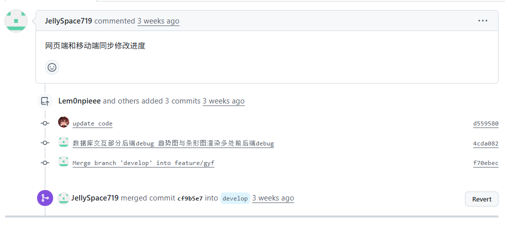
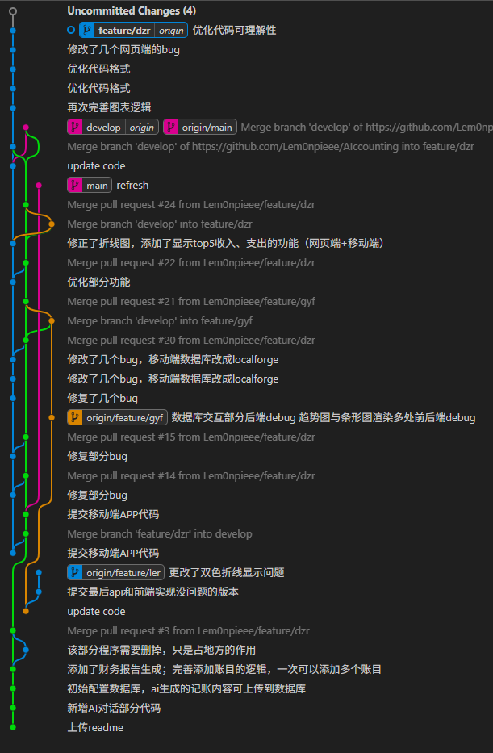
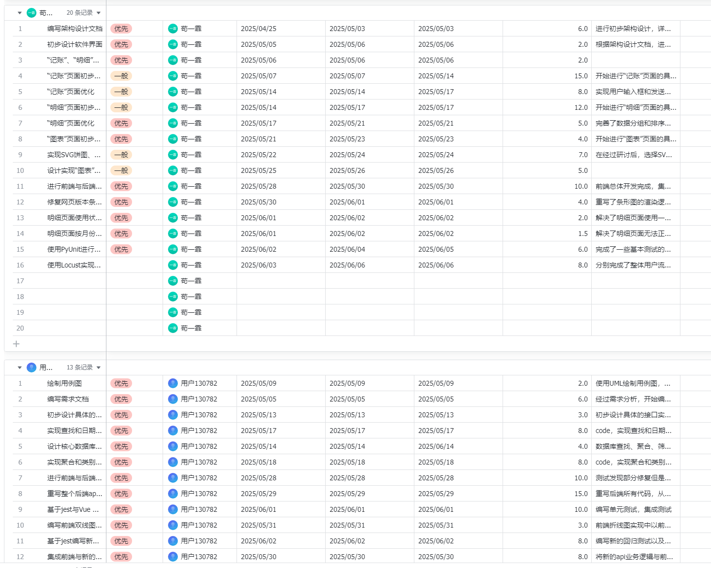
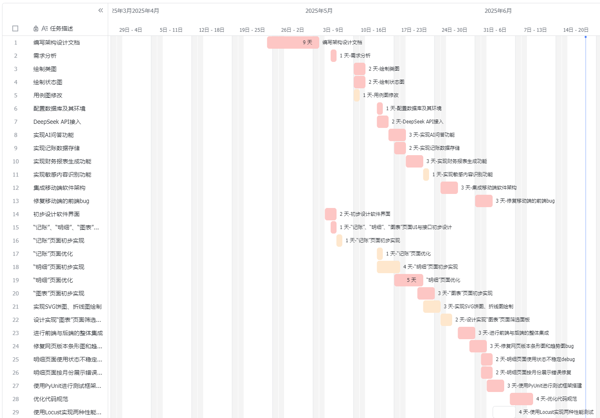

# 软件配置与运维文档  

## 一、配置管理

本项目的配置管理依托于源代码文件和目录结构。网页端的代码和相关配置集中在 `AIccounting-main` 目录下，移动端的开发工作和配置则全部位于 `App-Mobile` 目录及其子目录。网页端和移动端的配置内容完全分离，分别由对应开发成员独立维护。配置参数（如数据库连接方式、API 路径、端口号等）直接在具体的JavaScript、Vue或相关源代码文件中定义和管理。
```
AIccounting/
├── AIccounting-main/
│   ├── api.py
│   ├── chat.py
│   ├── main.py
│   ├── sql.py
│   ├── tests/
│   │   ├── locustfile.py
│   │   ├── locustfile_extreme.py
│   │   ├── run_tests.py
│   │   └── test_api.py
│   └── 文档/
├── App/
│   ├── build/
│   ├── config/
│   ├── src/
│   │   ├── components/
│   │   ├── router/
│   │   ├── views/
│   │   ├── App.vue
│   │   └── main.js
│   ├── test/
│   └── 测试/
├── App-Mobile/
│   ├── cordova/
│   ├── platforms/
│   ├── plugins/
│   ├── src/
│   └── www/
├── 文档/
├── 使用说明.md
└── 运维文档.md
```
团队成员在调整配置时，需在本地完成修改并通过 Git 的分支管理提交到远程仓库。所有配置相关的变更都通过 Pull Request 流程进行协作和审核。每次 PR 都需在描述中写明变更内容和影响范围，确保团队成员能及时把握每一次配置调整的背景和目的。



## 二、版本控制规范

项目所有源代码和配置文件均托管在 GitHub 仓库（https://github.com/Lem0npieee/AIccounting
）。仓库采用主分支 `main` 和开发分支 `develop` 并行管理，同时每位成员根据开发任务创建个人功能分支，命名格式为 `feature/成员名`。开发完成后先合并回 `develop`，经过团队测试和 review 后统一合并到 `main`，以保证主分支的稳定性。

团队成员在每次代码提交时都会提供相关说明，描述本次提交的主要内容和目的。团队成员在创建 Pull Request 时同样会添加必要的说明，便于其他成员理解变更内容。


## 三、持续集成与部署

### 1. 项目当前的测试与集成方案

本项目采用手动集成方式进行代码管理与部署。团队成员在本

### 2. 测试框架与实践

AIccounting 项目的网页端前后端均建立了完善的自动化测试体系，尤其高度重视回归测试。每次主要功能上线前，回归测试都是必不可少的环节，必须完整执行，以确保历史功能在持续迭代和新功能开发过程中始终保持稳定。

后端采用 Python 的 unittest 框架进行单元测试、API测试和回归测试，所有测试代码集中在 `AIccounting-main/tests/` 目录。测试内容覆盖数据库操作、API接口、日期工具、主程序框架等模块。回归测试通过自动发现并运行所有以 `test_*.py` 命名的测试文件，确保每次代码变更后核心功能的正确性。API 层面，`test_api.py` 文件对主要接口和路由进行功能性测试，验证数据处理和返回格式。性能测试方面，项目引入 Locust 框架，`locustfile.py` 用于模拟真实用户业务流程下的系统性能，`locustfile_extreme.py` 用于对关键接口进行高并发极限压力测试，帮助发现系统瓶颈。

前端部分，采用 Jest 和 Vue Test Utils 进行单元测试，相关配置位于 `App/test/unit/jest.conf.js`，UI 测试流程已文档化，详见 `App/测试/前端UI测试说明文档.md`。前端测试同样作为回归测试的重要组成部分，确保页面组件和交互逻辑在持续迭代中保持稳定。

### 3. 测试执行与回归流程

后端所有单元测试和回归测试会在每次主要功能上线前完整执行，前端测试同样会同步执行，确保历史功能未受影响。回归测试不仅是质量保障的核心环节，也是团队交付稳定可靠系统的基本要求。测试报告和执行记录统一归档。

### 4. 环境配置与手动部署流程

项目支持多环境部署。开发环境为本地调试，测试环境为团队共享服务器，生产环境为正式对外服务。Web 端构建后将产物上传至服务器，移动端构建 Web 资源并用 Cordova 脚本打包生成 APK，后端服务需 Python 3.11 和 MySQL 8.0 环境，依赖 Flask、Flask-CORS、OpenAI 等库。

## 四、飞书在团队运维与协作中的具体应用

飞书是团队核心的协作与运维支撑平台，承载了项目管理、进度跟踪、经验归档等多项关键功能。团队充分利用飞书的文档、群聊、表格、任务、日历等多种工具，将日常协作和运维保障体系化、流程化。下面详细介绍飞书在团队的各项记录与管理功能：

### 1. 任务分工与项目职责记录

团队通过飞书表格对所有开发与运维任务进行结构化记录。表格内容包括任务描述、优先级、负责人、起止日期、实际完成时间、工时等关键信息。该表格用于明确每项任务的分配和进度，便于团队成员认领、跟踪和协作。通过这种方式，团队能够实时掌握各项任务的执行情况，及时调整资源分配，提升项目管理效率。表格的使用有助于责任到人、进度透明、过程可追溯，有效保障了软件开发过程的规范性和高效性。


### 2. 开发进度与甘特图管理

团队通过飞书甘特图对项目开发进度进行可视化管理。甘特图详细记录了每项任务的起止时间、实际完成情况、负责人及任务之间的依赖关系。通过甘特图，团队能够直观了解各阶段任务的进展、重叠与衔接，及时发现进度风险和资源冲突。甘特图的动态展示有助于合理安排开发节奏，动态调整优先级，确保项目各阶段目标如期完成。甘特图的使用提升了项目计划的透明度和执行的可控性，是团队高效协作和科学排期的重要工具。


### 3. 日志与周报记录

团队通过飞书表格每日记录工作日志，内容包括当天工作总结、后续工作计划、遇到的问题、日报提交人等关键信息。该表格用于系统化归档每位成员的日常工作进展和问题反馈，便于项目负责人及时了解团队整体动态和个体任务完成情况。通过日报的持续积累，团队能够追踪项目进度、发现和解决开发过程中的实际问题，同时为后续的周报、绩效评估和经验总结提供详实的数据支撑。这种机制提升了团队沟通效率和项目管理的规范性。


### 4. 会议纪要与决策归档

每次团队讨论或例会，均由专人负责在飞书文档中记录会议纪要。纪要内容包括会议主题、参与人员、讨论要点、决策结论和后续待办事项等。所有重要的技术决策、需求变更、风险识别等内容都会被详细归档，方便后续追踪和查阅。对于争议较大的问题，团队会通过飞书文档协作进行多轮讨论和意见征集，最终形成统一的决策。
（考虑补）

### 5. 成员工作量与绩效记录

飞书表格被用来记录每位成员的开发投入时长、实际完成任务量等绩效指标。团队会根据表格数据分析每个人的工作饱和度，合理安排任务，防止出现过度加班或分配不均。部分阶段性评优、奖惩、学分认定等也会参考飞书表格中的实际记录。
（后续补充）

### 6. 通知、反馈与应急响应

团队日常沟通、任务通知、问题反馈依赖微信或飞书群聊进行。每当有需求变更、bug 紧急修复、部署上线或遇到线上故障时，相关成员会在飞书群第一时间同步信息，确保全员及时响应。团队也会在飞书群内定期提醒大家按时提交日志、更新进度或填写周报。


## 五、代码备份与故障处理

### 1. 代码与数据备份策略

团队采用“本地备份 + 远程仓库”双保险策略。每位成员需定期将当前开发代码在本地保存一份，同时所有代码和配置都推送到 GitHub 的各自仓库。通过 Git 版本历史，团队可以随时回溯到任意时间点的项目状态。飞书文档和表格资料也建议定期导出备份，防止因平台或账号异常造成资料丢失。

### 2. 故障处理与回滚机制

当项目开发或运行过程中出现严重 bug 或故障，发现问题的成员会在飞书群内详细描述问题表现、影响范围和初步判断，团队协作定位原因。若需回退，团队利用 Git 的历史版本功能回滚到上一个稳定提交。所有故障的原因、排查过程和解决经验都会在飞书知识库归档，方便后续检索和新成员学习。

